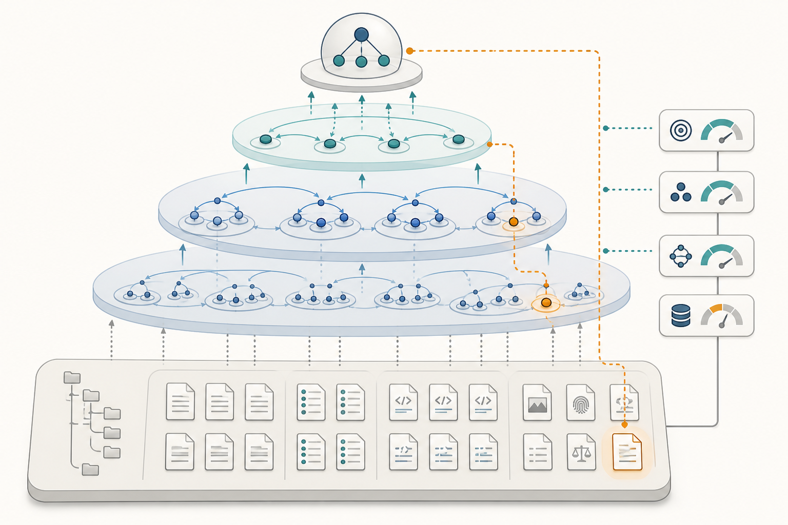
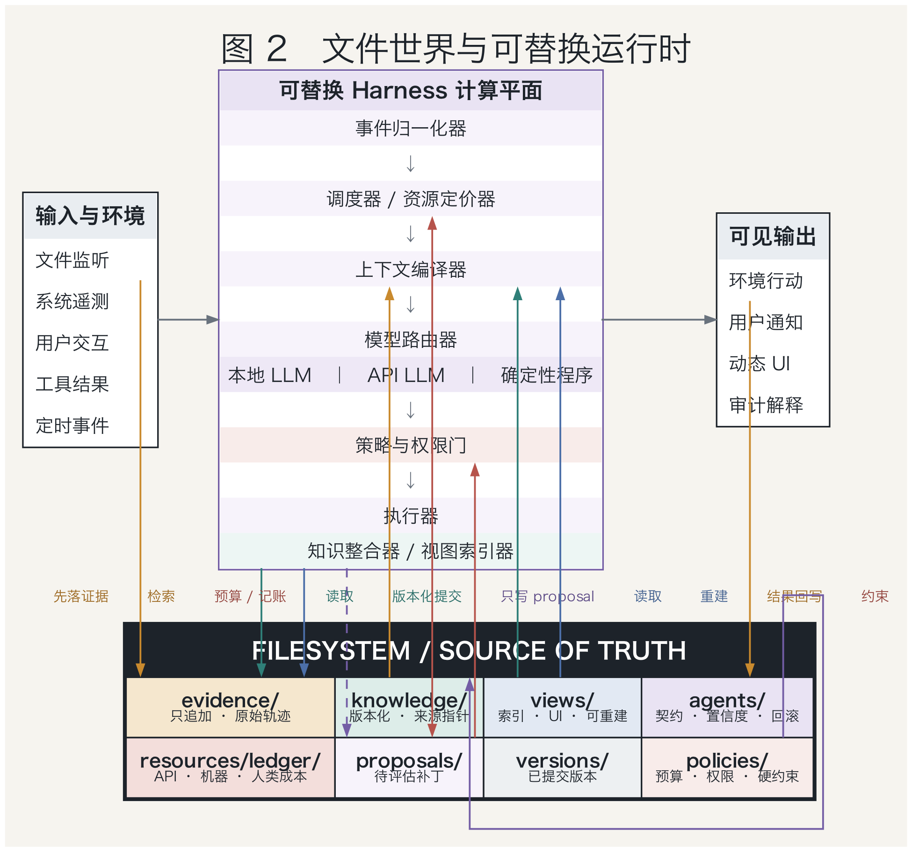
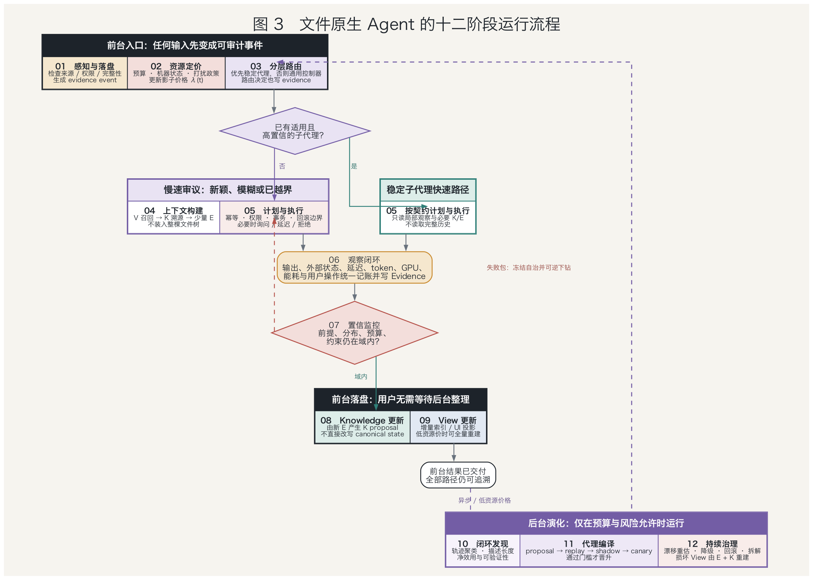
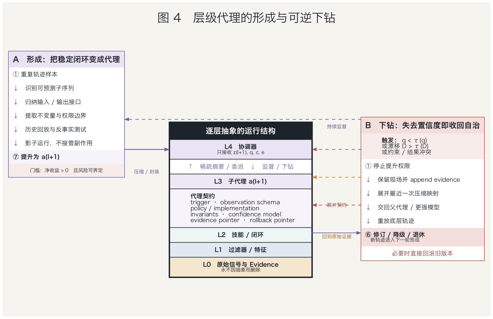
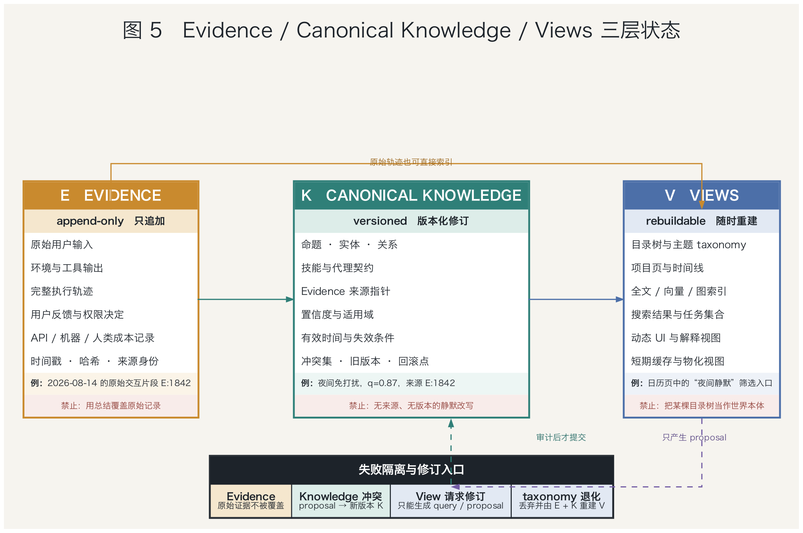
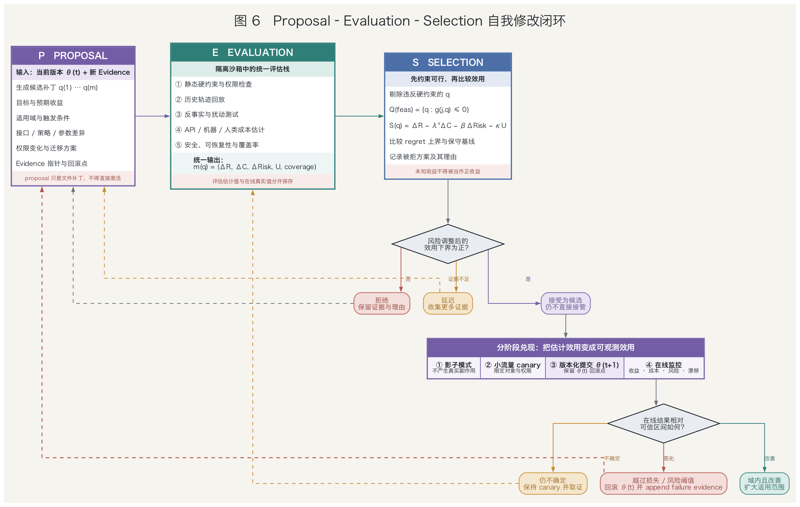
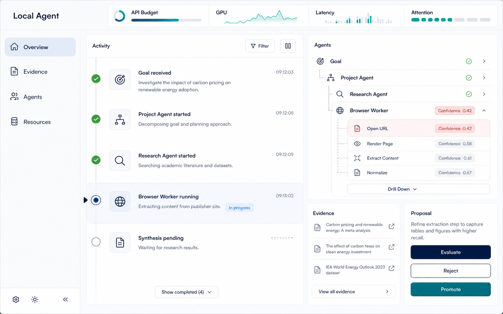

<style>
.math.display {
  display: block;
  margin: 1.25rem 0;
  padding: 0.95rem 1.1rem;
  overflow-x: auto;
  border-left: 3px solid var(--bs-primary, #2b7a78);
  border-radius: 0 0.5rem 0.5rem 0;
  background: color-mix(in srgb, var(--bs-primary, #2b7a78) 8%, transparent);
}

@media (max-width: 640px) {
  main.content :not(pre) > code {
    white-space: normal;
    overflow-wrap: anywhere;
    word-break: break-word;
  }

  main.content a {
    overflow-wrap: anywhere;
    word-break: break-word;
  }
}
</style>

<!-- wordm:lang zh -->

## 摘要

长期运行的本地 Agent 面临一个不能靠扩大上下文窗口消除的矛盾：若每次任务都让通用大模型重读历史、重新推理，API 费用、本地算力、延迟与用户注意力会随经验增长；若系统持续重写摘要、固化流程，又会把暂时规律误当成稳定规律，并在环境变化时失去纠错依据。本文提出一种文件原生 Agent 参考架构，将资源约束视为形成抽象层级的动力，将可追溯文件状态视为抽象可逆的条件。这里“文件原生”不是让文件系统负责思考，而是让跨会话语义状态具有开放、可版本化、可迁移的规范表示，执行语义仍由受约束运行时提供。

本文把持久文件世界表示为 $F_t=(E_t,K_t,V_t,A_t,R_t)$：$E_t$ 保存带来源的观察证据，原则上逻辑追加；$K_t$ 保存可修订的规范知识；$V_t$ 保存目录、索引、图与界面等可重建视图；$A_t$ 保存代理层级、行为契约及版本；$R_t$ 保存预算、资源价格与使用账本。在此基础上，本文把 API 金额、GPU/CPU 时间、内存、能耗、延迟、存储、检索以及人类等待、阅读和中断纳入同一约束决策模型，但将隐私、权限和不可逆操作置于不可交换的硬边界之外。

资源稀缺使反复出现的感知—决策—行动闭环具有被压缩的经济价值。本文将其形式化为带适用域、内部策略、终止条件、接口契约、风险门控、证据谱系和回退路径的子代理；只有当资源节省的保守估计超过构建、监控、维护与失败损失时，候选闭环才由观察状态逐步晋升。所谓置信度不是模型自报数字，而是由可观测任务结果校准的风险预测；当输入越出适用域、风险超过阈值或硬约束触发时，控制权返回更通用的上层，并沿来源链重新展开底层轨迹。

本文进一步给出从信号落盘到后台闭环编译的十二阶段运行流程，并说明可插拔 harness、模型与工具只是可替换执行器，不能成为长期 source of truth。本文的贡献是架构综合、条件性数学模型与可检验流程，而非关于人类心智机制的实证结论。文件组织研究、持续记忆压缩、层级强化学习、信息瓶颈、资源理性与安全策略改进为若干局部判断提供依据；三层知识分离、统一资源账本、行为编译和可逆下钻的整体组合仍是有待长时程实验检验的研究假说。

**关键词：** 文件原生 Agent；资源受限智能；层级代理；行为编译；可逆抽象；长期记忆；人类注意力成本；可重建视图

## 1 引言

设想一个在个人电脑上持续工作数月的 Agent。它处理文件、检索资料、维护项目、调用模型，并逐渐熟悉用户偏好。经验增加本应带来复用，但平坦架构往往产生相反趋势：历史越多，检索候选越大，提示越长，重新理解上下文越慢；若通过反复摘要维持短上下文，错误与遗漏又会在多次改写中累积。真正的问题因此不是“如何整理更多文件”，而是系统怎样在经验压缩带来的效率与保留纠错依据之间维持可控张力。

这一矛盾在本地 Agent 中尤其尖锐。云端模型有按 token 或请求计价的直接成本，本地模型虽然没有逐次账单，却消耗 GPU 时间、显存、CPU、能量和设备前台可用性；用户被追问、等待结果、阅读说明或从正在进行的工作中被打断，也承担真实机会成本。若这些代价不进入决策，Agent 没有内生理由复用稳定行为，也无法判断一次更强模型调用与一次用户澄清何者更值得。资源问题不是部署附录，而是长期认知结构为何形成的动力。

然而，压缩不能被视作无条件进步。一段流程在过去十次成功，可能只是因为工具版本、文件格式和用户目标暂时不变；把它封装后，上层不再观察被省略的条件，少量高损失错误可能抵消大量 token 节省。因此本文不把“层层代理”定义为越来越多的聊天模型，而把它定义为可撤销的行为编译：反复闭环在明示适用域内被封装成低成本控制单元，同时保留测试、资源画像、异常出口和指向原始轨迹的稳定引用。

文件在这里承担的是持久状态边界，而不是执行机制。普通文件系统提供字节、路径、权限和有限的原子更新语义，它不会自行解释目标、调度动作或判断知识真假。执行这些状态的是版本化运行时、模型、工具适配器与操作系统。因此，更准确的 file-native 定义是：需要跨会话保存并允许用户检查的语义状态具有开放文件表示，内存对象、数据库索引、向量库和界面缓存则可由规范状态重建。关机迁移后仍能恢复目标、证据、知识与未完成工作，连续性才属于 Agent 而非某个进程。

现有研究已经显示组织与压缩的收益并不等同于答案质量。Zhou 等在 140 个 ALFWorld 任务的增长实验中发现，组织化文件存储在较大材料上主要降低检索成本，但多数管理模型的 taxonomy adherence 随历史增长下降，每个 episode 的维护仍约需 6—12 轮；实验范围内存储总体仍有用，不能概括成“记忆越用越差”[1]。这个结果提示，目录是一种访问视图，而不宜同时充当原始经历、当前判断和唯一语义关系的永久载体。

持续 consolidation 也不是自动的解法。Zhang 等报告，在若干任务中反复把旧抽象与新经验重新合并会出现先增益、后退化；在其由 19 个原本全部可解的 ARC-AGI 问题组成的流式设置里，第十轮准确率从 100% 降至 52.6%，只保留 episodic trace 的对照仍具有竞争力[2]。该预印本摘要、正文与 Figure 2 对失败率的文字报告彼此不一致，本文采用图注可直接核对的 52.6% 准确率。这是特定实验而非普遍定理，却足以支持一个克制原则：抽象必须被门控，旧证据不应因新摘要产生而静默消失。

本文据此提出的主线是：资源稀缺迫使系统寻找可以复用的低成本闭环，开放环境则迫使这些闭环保留可逆展开的能力。前者解释为什么层级会形成，后者解释为什么 evidence、canonical knowledge 与 views 必须分离。若只有资源模型，系统会倾向于过早自动化；若只有证据分层，系统虽可审计，却仍可能每次昂贵地从头推理。两者结合以后，压缩成为可评估的投资，而不是不可撤销的遗忘。

本文的陈述分为三种地位。带明确来源和数字的内容属于文献事实，并以编号引用；$F=(E,K,V,A,R)$、统一资源账本、十二阶段流程和行为编译协议属于本文综合；“完整系统能在保持质量的同时降低长期总成本”“多视图能延缓组织退化”等结论属于待验证假设。后文给出的数学关系说明设计在何种条件下合理，不把架构直觉冒充成已经完成的实证证明，也不对人的真实认知机制提出经验性结论。



图 1　资源压力下的层级心智与可逆下钻。AI 生成的概念性示意图，不承载实验数据；蓝绿色路径表示由底层信号向稳定代理的压缩，橙色路径表示风险上升后的展开。

## 2 相关工作与问题界定

层级强化学习为行为封装提供了成熟但有限的语言。Sutton、Precup 与 Singh 将时间延展动作定义为 option $o=(I_o,\pi_o,\beta_o)$，分别表示启动集合、内部策略与终止规则，并说明给定 MDP 与 options 会诱导半马尔可夫决策过程[5]。MAXQ 则在预先给定的任务层级中分解价值函数，并在相应条件下得到递归最优性[6]。这些结果支持多步闭环的形式化，却没有证明 LLM 能自主发现正确层级，也不保证递归最优等于全局最优。

信息瓶颈从另一侧刻画抽象：从底层变量 $X$ 生成较短表示 $Z$，同时保留与相关变量 $Y$ 有关的信息，其典型目标为 $\min I(X;Z)-\beta I(Z;Y)$[7]。对本文而言，$X$ 可取完整轨迹，$Z$ 可取子代理向父层暴露的接口，$Y$ 是父任务所需的未来结果。重要边界在于，充分性永远相对于指定的 $Y$；少量被压掉的信息也可能决定罕见灾难，因此互信息只能帮助发现候选，不能替代安全约束、尾部风险和真实回放。

RLM 将超长输入外置到可编程 REPL，由根模型通过代码检查、切分并递归调用子模型，在若干长上下文基准上扩展了基础模型的有效工作范围[3]。Recursive Agent Harnesses 又把递归单元从裸模型扩展为带文件、代码、规划和 spawn 能力的完整 harness，并在 Oolong-Synthetic 的特定实验中报告优于所比较基线的结果[4]。二者在各自所测长上下文基准上，为递归执行可作为有用原语提供了初步证据；RAH 只测试 Oolong-Synthetic，部分基线也并非同一实验内逐样本重跑。这些工作没有研究跨月轨迹中何时形成永久子代理，本文的稳定性检测与发布协议正针对这个空缺。

资源理性研究主张，应在实际计算限制下理解主体如何使用有限资源，而不是以无限计算的理想最优为唯一标准[8][9]。本文接受这一原则，但不把具体工程模型归功于既有认知理论：将 API 价格、GPU 秒、能耗、延迟、检索与人类交互放入同一资源向量，以及利用在线影子价格路由本地模型、云模型和用户询问，均是本文面向本地 Agent 的扩展。特别是人的注意力只能被间接估计，不能换算成一个声称客观的 token 单价。

在自我修改方面，High Confidence Policy Improvement 提供了性能下界与置信门的思想[10]；robust baseline regret 与 SPIBB 则分别在模型误差或数据不充分区域回退稳定基线[11][12]。本文后续的 proposal—evaluation—selection 借鉴这种保守门控，却不自动继承其统计保证。LLM 候选空间开放，评价与提议常共享偏差，任务分布也会变化；只有覆盖、误差界、平稳性和多次检验控制等条件成立时，保守下界才具有相应置信含义。

由此可把本文的研究对象界定为一种受约束的、持久状态外置的部分可观测控制系统。真实环境状态 $s_t$ 包含用户意图、文件之外的事件与未来任务分布，Agent 只观察 $o_t\sim O(\cdot\mid s_t,a_{t-1})$，并通过文件、检索器、规则与模型维护近似信念。文件化能够记录“系统观察过什么、当前接受什么”，却不能把伪造输入或过期网页变成客观事实，也不能把 POMDP 变成完全可观测 MDP。

为避免“文件原生”与“文件万能”的混淆，本文把持久语义状态记为 $F_t$，把解释和执行它的运行配置记为 $\Theta_t$，整体状态写成 $S_t=(F_t,\Theta_t)$。它的演化由下式刻画：

$$
S_{t+1}=T_{\Theta_t}(S_t,o_{t+1},a_t;\xi_t).
$$

其中 $\xi_t$ 表示模型采样、设备测量和外部服务的不确定性。文件是可审计状态，$T_{\Theta_t}$ 才是状态转移；若运行时版本未记录，同一文件也可能被不同解释器赋予不同含义。

## 3 文件世界：证据、知识、视图、代理与资源

本文将文件世界定义为 $F_t=(E_t,K_t,V_t,A_t,R_t)$。这个五元组不是外部世界真相的全集，而是 Agent 关于自身经历、当前判断、访问方式、可调用能力和资源承诺的规范记录。一次新观察到来时，更新不应是让 LLM 把旧目录整体重写，而应依次完成证据追加、知识提案、视图更新、代理状态与资源账本更新。整体更新可以压缩为：

$$
F_{t+1}=\mathcal U(F_t,o_{t+1},a_t,\xi_t).
$$

其中 $\mathcal U$ 是受事务与权限约束的版本化更新算子。

$E_t$ 是 evidence 层，记录系统确实接收或观察到的内容，而不是宣称内容必然真实。每项证据具有稳定标识、来源主体、采集时间、内容哈希、信任域、权限、敏感级别、保留策略和派生关系。用户原话、网页快照、工具请求与返回、模型原始输出、文件变更和资源测量都先进入这一层。若来源后来被证伪，系统追加 retraction、contradicts 或 supersedes 关系，而不把旧记录改成仿佛从未发生。

“append-only”在这里是逻辑审计语义，不是无限保存的借口。用户撤回同意、法律保留期到期或敏感数据需要清除时，系统必须支持密钥擦除、删除墓碑、派生副本追踪和 view 重建。删除会限制完整重放，论文应诚实记录这种取舍。证据层能保证的是对系统观察史的可追责性，不能保证观察准确；恶意提示、传感器故障和过期资料仍需要信任标记、交叉验证与权限隔离。

$K_t$ 是 canonical knowledge 层，保存系统当前接受但可撤销的主张。一个知识对象不仅包含 statement，还应包含适用范围、有效时间、支持与反对证据、置信区间、生成器、评估器、状态与前一版本。新证据触发的是保留、修订、拆分、合并或撤回提案，而非覆盖式“总结”。矛盾来源可以长期并存，当前选择必须留下理由。这样，知识变化成为可审查的 truth-maintenance，而不是语义正确性无法追踪的文本漂移。

$V_t$ 是 views 层，包括项目目录、人物目录、时间线、全文索引、向量索引、知识图邻接表、搜索缓存与用户界面。真实知识通常同时属于人物、主题、时间和项目，一棵树要求单一父节点，无法表达全部关系。本文因此允许多个视图链接同一 canonical ID，并令 $V_t=B_{\phi_t}(E_t,K_t,A_t,R_t)$，其中构建器 $B$ 与参数 $\phi_t$ 都被版本化。删除 $V_t$ 后可以重建，才说明它是投影而非隐藏真相。

这种可重建性有严格边界。若源对象与构建器完整，重建可以恢复结构等价的投影，却不能保证 $K_t$ 中的判断正确，也不能保证随机嵌入模型产生逐位相同的索引。验收应测量对象覆盖率、悬空链接率、来源可追溯率、矛盾暴露率、查询结果差异和重建时间。向量数据库、SQLite 与内存缓存都可用于性能，但任何只存在其中、删除后便永久消失的语义状态都违反文件原生原则。

$A_t$ 保存行为抽象，而不是另一棵知识树。每个子代理具有稳定身份、版本、启动条件、输入输出 schema、内部策略或程序、终止条件、资源包络、风险门控、评估集、权限与回退指针。控制委派可以呈层级，运行调用更常是共享能力的有向图，知识关系则是多父图；三种结构必须分开。一个 OCR 能力可被多个父流程复用，一条知识也可进入多个 view，不应因目录便利被强制复制或绑定到唯一父代理。

$R_t$ 是资源账本，保存预算、价格、机器状态、使用记录和人类交互事件。事实与估计必须分开：token、墙钟时间、GPU 秒和输入字符数可直接计量，能耗可能来自采样估算，注意力负担则是潜变量。账本应同时保存原始观测、估计模型版本、置信区间与用户声明偏好，使以后能够重算成本。若只存一个总分，影子价格或权重改变后，历史决策将无法复核。

五层之间存在明确依赖：$E$ 为 $K$ 的主张提供来源，$K$ 与 $E$ 为 $V$ 提供重建材料，$A$ 的契约与发布记录也由证据和评估支持，$R$ 则对每次读取、推理、执行、维护和用户干预计价。反向依赖受到限制：视图不能静默改写知识，子代理不能绕过提案直接修改自身评估门槛，资源优化也不能“购买”被硬政策禁止的权限。持久文件世界包括 $E,K,V,A,R$，但语义上的 source of truth 是 $E,K,A,R$ 以及生成 $V$ 的版本化构建清单；$V$ 可持久化以加速访问，却不具有独立语义权威，执行语义仍由被记录版本的运行时给出。



图 2　文件世界与可替换运行时。实线表示规范写入或强依赖，虚线表示可重建派生；模型、浏览器、代码沙箱与 Harness 通过契约接入，不拥有唯一语义状态。

这个分层直接回应长期组织退化。Zhou 等的实验说明 taxonomy 指标与任务效用不能等同，工具形态还会显著偏置文件粒度[1]；因此本文把树的兄弟可区分、父节点覆盖和树距离等要求限定为某个 view 的质量目标。Zhang 等的结果则支持保留 episode 身份并门控抽象[2]；因此 canonical 条目必须引用 evidence，旧证据不得被反复 consolidation 的最终文本取代。由此得到的三层设计是本文综合，而不是两篇论文已经验证的现成架构。

文件原生还要求恢复语义。进程被杀死、索引损坏或运行时更换后，系统应从最近快照与已提交事件恢复；若外部动作已经发生而本地提交失败，则通过幂等键和回执对账，而不能盲目重放。这里可审计并不等于安全：明文文件、备份、索引和崩溃转储都会扩大泄露面，所以高敏 evidence 需要加密、最小读取、保留期限和派生删除。数据在本地只是部署属性，隐私仍取决于清楚的威胁模型。

## 4 统一资源效用：层级形成的经济动力

一次行动消耗的资源写成如下向量：

$$
c_t=(c_t^{api},c_t^{gpu},c_t^{cpu},c_t^{ram},c_t^{energy},c_t^{latency},c_t^{storage},c_t^{retrieval},c_t^{human}).
$$

API 项按输入、输出、缓存和重试计价；本地推理记录模型加载、prefill、decode、GPU 秒、峰值显存、CPU 时间、能耗和对前台工作的干扰。存储字节通常便宜，但未来为扫描、重排和重新理解它付出的检索成本并不便宜，因此保留 evidence 与清理可重建 view 可以拥有不同策略。

多种资源没有天然公度性，故本文先定义硬可行集，再讨论可交换成本。令 $\mathcal F_t$ 包含权限、隐私、用户禁令、不可逆动作审批和安全不变量，策略只能从 $a_t\in\mathcal F_t$ 中选择。在这一可行域内，优化问题写成：

$$
\max_{\pi}\;\mathbb E_\pi\!\left[\sum_{t\ge0}\gamma^t r_t\right],
\qquad
\mathbb E_\pi\!\left[\sum_{t\ge0}\gamma^t c_{t,k}\right]\le B_k
\quad (1\le k\le K).
$$

安全与尊严不被当成足够高收益即可抵消的价格项。

对能够以预算协调的资源，引入非负拉格朗日乘子 $\lambda_k$，可得到：

$$
\mathcal L(\pi,\lambda)=\mathbb E_\pi\!\left[\sum_t\gamma^t(r_t-\lambda^\top c_t)\right]+\lambda^\top B.
$$

这个式子的推导只是把每个约束的超支量乘以惩罚后加回目标。在强对偶、适当约束资格条件与灵敏度分析成立时，最优乘子 $\lambda_k^*$ 可解释为放宽一单位预算的边际价值或其次梯度；在离散、非凸的 LLM 系统中，在线 $\lambda_{t,k}$ 主要是预算压力的控制信号，不声称等于真实全局影子价格。

影子价格可用在线原始—对偶更新近似。若本时段第 $k$ 类资源额度为 $b_{t,k}$，则：

$$
\lambda_{t+1,k}=\left[\lambda_{t,k}+\eta_t(c_{t,k}-b_{t,k})\right]_+.
$$

连续超支使价格上升，路由器转向小模型、缓存、延迟执行或拒绝低价值任务；持续结余则使价格下降。日预算、API 月配额和电池余量可维护不同窗口。这个控制器在凸性、稳定反馈等条件下具有经典解释，但离散、非凸的 LLM 系统不应据此宣称全局最优。

人类交互成本需要单独处理。可观测代理量构成向量：

$$
h_t=(\tau_t^{wait},\tau_t^{type},\tau_t^{read},n_t^{interrupt},\ell_t^{switch},\ell_t^{privacy}),
$$

分别表示等待、输入、阅读、中断、任务切换恢复与隐私负担。系统能直接观察的只是部分代理量，真正成本 $H_t$ 是潜变量，因而应维护 $p(H_t\mid z_{1:t},f_{1:t})$ 或保守区间，其中 $z_t$ 是交互特征，$f_t$ 是稀疏的显式反馈。沉默不等于同意，快速点击也不证明注意力成本低。

工程上可用下式进行风险厌恶估计：

$$
\widehat c_t^{human}=\mathbb E[H_t\mid z_{1:t}]+\rho\,\mathrm{CVaR}_\alpha(H_t\mid z_{1:t}).
$$

这使少数极具打扰性的场景得到额外权重。用户声明的安静时段、主动通知上限、答案长度偏好和必须确认的动作应优先于行为推断，并允许查看、纠正、清空或关闭个性化学习。论文实验还必须分别报告输入分钟、中断次数与主观反馈，不能只展示一个看似精确的“注意力币值”。

是否询问用户可以由信息行动价值说明。若问题 $\mathsf q$ 的回答 $y$ 会把信念从 $b_t$ 更新为 $b_t^y$，则：

$$
\mathrm{VOI}(\mathsf q)=\mathbb E_y\!\left[\max_a Q(b_t^y,a)\right]-\max_aQ(b_t,a).
$$

只有当它超过询问的计算、延迟、人类成本与风险余量时，追问才改善长期决策。许多不确定性并不改变最优行动，因而不值得打断用户；高影响且不可逆的行动则即使 VOI 较低，也可能因硬政策而必须确认。

这个模型也给出了行为编译的最小经济判据。若平坦推理、子代理与监控的单次资源向量分别为 $c^{full},c^O,c^{mon}$，构建与维护资源为 $c_O^{build},c_O^{maint}$，预计折扣调用次数为 $N_O$，失败概率和净效用损失为 $p_O,L_O$，抽象损失为 $\Delta_O^{abs}$，则在评估窗口内冻结价格时：

$$
\mathrm{EV}_O=N_O\lambda^\top(c^{full}-c^O-c^{mon})-\lambda^\top(c_O^{build}+c_O^{maint})-p_OL_O-\Delta_O^{abs}.
$$

价格随时间变化时必须回到折扣和式逐期计价；只有该局部近似的保守下界为正且硬门通过，形成一层新代理才有理据。

层级深度也不是越大越好。每增加一层会降低上层读取和推理成本，却增加路由、接口转换、监控、版本迁移与误差传播。把这些关系合在一起，可写成：

$$
C(d)=C_{infer}(d)+C_{route}(d)+C_{maint}(d)+C_{error}(d).
$$

合理深度位于边际节省不再超过边际协调与风险成本的位置。由此，“心智层层包裹”在本文中不是目的论，而是资源价格、任务可压缩性与失效损失共同决定的可撤销模型选择；撤销封装与创建封装具有同等地位。



图 3　文件原生 Agent 的十二阶段运行流程。前台完成证据落盘、资源定价、分层执行与事务提交，后台维护知识和视图、发现稳定闭环并治理代理版本；失败沿证据链回到更细粒度状态。

## 5 十二阶段运行流程

上述状态与目标只有落实到每次事件的因果链，才不是静态目录设计。完整运行分成前台响应与后台学习两条速度不同但共享证据的路径：前台优先完成当前任务并生成可审计结果，后台在资源价格较低时维护知识、视图与代理。十二个阶段不是十二个独立模块，而是一条“运行产生证据、证据支持压缩、压缩减少未来成本、异常重新打开证据”的闭环；任何阶段失败都应留下显式事件，而不是静默跳过。

第一阶段是感知与来源检查。文件观察器、用户界面、系统指标和工具适配器接收信号，标记主体、权限、信任域与敏感级别。第二阶段是证据落盘：原始输入、内容哈希、时间、解析器版本和父事件被写入 $E_t$，大对象进入内容寻址存储。只有事务提交成功，观察才成为耐久事件；外部文本中的指令默认属于不可信数据，不能因被读取便取得工具权限。

第三阶段是资源定价。系统读取 API 余额、机器负载、电池、网络、截止期、用户安静时段与近期交互，更新预算余量和 $\lambda_t$，同时保留每项原始量。第四阶段是分层路由：根据任务、适用域与经过结果校准的风险，选择已编译子代理、通用规划器、本地或云模型，也可延迟处理。若没有可靠反馈，风险被标为未知并走保守路径，而不是采用 LLM 自报置信度。

第五阶段是上下文构建。检索器先从可重建 views 找候选，再沿 provenance 读取必要的 canonical 条目和少量 evidence；context manifest 固化每个对象的版本和哈希，避免全树扫描。第六阶段是计划与执行：所选代理在 capability lease 限定的文件、网络、模型、时间与金额范围内产生工具调用或候选 patch，写操作先进入 staging，不能直接覆盖规范文件。

第七阶段是事务提交与外部对账。运行时验证 schema、权限、预算、读取集哈希和不变量，使用 prepare、原子安装与 commit marker 提交；发生并发变化则产生冲突事件。邮件、支付等外部副作用必须带幂等键，先保存服务回执再提交本地状态，崩溃恢复时通过对账决定继续、补偿或请求用户，绝不凭猜测重复执行。

第八阶段是结果评价与统一记账。系统把任务结果、异常、模型 token、GPU 秒、能耗、延迟、存储增长和用户操作写入 evidence 与 $R_t$，按预定义成功判据产生可校准标签。第九阶段是风险门控与可逆下钻：若契约前提失败、输入 OOD、实际成本异常或预测失败风险越阈值，子代理终止并生成 failure packet，将已完成步骤、未决状态、证据和 trace 交还父代理，必要时展开原始步骤。

第十阶段是知识与视图维护。新证据只触发 canonical proposal，经来源与矛盾检查后版本化接受、争议或撤回；views 可做低成本增量更新，也可在后台整体重建。第十一阶段是闭环发现：轨迹聚类器寻找重复的上下文—行动—结果片段，计算复用频率、描述长度、资源净值、校准误差、漂移与尾部风险，只把同时通过可压缩性与安全门的模式送入候选区。

第十二阶段是代理编译与持续治理。候选依次经历历史留出回放、边界与反事实测试、shadow、低风险 canary 和有限权限部署；选择器只在相对平坦基线的效用下界为正且来源链完整时原子更新当前版本。发布后继续监控 risk–coverage、纠正率与结构 churn，退化时回滚或拆解。失败反例回到 evidence，因而系统形成的是可逆局部稳定，而非永远上升且最终固定的代理树。

在这一流程中，可插拔 harness 位于执行边界。DeepSeek Harness 官方开发者预览以 “Everything is a Plugin”、Cordis 插件组合和 append-only SessionEvent 为重要设计，并把会话事件作为模型上下文的派生来源[15]。本文借用模型、工具、provider、effect 与 agent loop 可替换的思想，但作出更强而独立的规定：跨会话的 $E,K,V,A,R$ 由文件协议持久化，Harness 只通过标准 process、event、patch、usage 与 trace 适配，不拥有 Agent 唯一身份。

因此，同一文件快照可以交由 DeepSeek Harness、直接 OpenAI-compatible API、本地推理、Python 沙箱或浏览器执行；适配器变化影响质量、成本和随机轨迹，却不能带走证据、知识版本、代理契约与资源账本。这个边界也使替换性可被检验：删除某个 Harness 私有缓存或更换模型后，系统可能变慢或产生新分支，但应仍能读取相同历史、恢复未完成工作并解释差异来自哪一执行版本。长期心智由此锚定在可审计状态，而非任何单一模型或框架。

## 6 从底层信号到层层代理：稳定闭环的自主编译

影子价格解释了系统为何愿意复用经验，却没有说明什么经验值得成为新的一层。若只按调用次数自动封装，Agent 会把偶然重复、临时工具约定和用户尚未稳定的偏好固化为永久结构；若要求完全证明后才封装，开放环境中的行为又几乎永远无法晋升。本文因此把层级形成定义为一条受证据约束的编译流水线：先发现候选闭环，再验证其适用域与净价值，最后发布为可监控、可终止、可回退的子代理。

底层监控器接收文件变更、工具返回、系统负载、用户输入与外部服务事件，并把它们规整为带时间、来源和因果关联的事件流。候选发现器不直接阅读所有原始文本，而在滑动窗口内比较“前置状态—行动序列—结束状态—资源消耗”的结构签名，寻找多次出现且边界相近的片段。这里的相似性既包括文本与参数，也包括结果、失败类型和副作用；只有表面步骤相同而结果机制不同的片段不应被合并。

重复只是必要线索，不是稳定性的定义。一个候选闭环需要同时经受四类检查：在相同适用条件下结果是否一致，轻微输入扰动后行为是否连续，工具与模型版本变化时契约是否仍成立，以及失败是否能被监控器及时识别。系统还应保留时间后切分的验证样本，防止用同一批轨迹既发现模式又宣布模式可靠。高频却高方差的流程更适合作为检索模板，而不是自主执行的子代理。

设底层历史为 $H_t$，候选接口为 $Z_t=\phi(H_t)$，父任务关心的未来量为 $Y_t$。信息瓶颈提供了压缩直觉：接口应减小 $I(H;Z)$，同时保留 $I(Z;Y)$[7]；但本文不把互信息当作发布许可。工程上还要检验给定 $Z$ 后底层历史是否仍显著改善结果预测：

$$
I(Y;H\mid Z)\leq\varepsilon_I.
$$

此外还要检查罕见高损失样本，因为很少的信息也可能恰好决定一次不可逆错误。

近似充分性还可转化为可回放的控制条件。若被接口映射到同一状态的两段历史，在所有允许行动上即时效用差不超过 $\varepsilon_r$，其下一抽象状态分布的总变差不超过 $\varepsilon_p$，则它们在给定任务族中近似可互换。在折扣因子为 $\gamma$、单步回报有界时，误差会以约 $\varepsilon_r/(1-\gamma)$ 和 $\varepsilon_p/(1-\gamma)^2$ 的量级累积；任务越长、损失越大，封装阈值就应越保守。

### 近似充分统计如何产生 Bellman 价值误差界

为了看清“压缩误差为何会被长期决策放大”，先固定一个任务族和折扣因子 $0<\gamma<1$。底层历史记为 $h$，压缩状态为 $z=\phi(h)$。假设凡是被映射到同一个 $z$ 的两段历史 $h,h'$，对任意行动 $a$ 都满足两项近似充分性条件：即时奖励之差不超过 $\varepsilon_r$，而下一时刻压缩状态的分布之总变差距离不超过 $\varepsilon_p$。再假设奖励满足 $|r(h,a)|\le R_{\max}$，因此任何折扣价值函数都有 $\|V\|_\infty\le R_{\max}/(1-\gamma)$。同一抽象状态内还须具有共同可行动作集；若动作可用性不同，就把它编码进 $z$，或给无效动作统一禁止损失。这里的条件不是说摘要保留了历史的一切，而是说它保留了当前任务作决策所需的奖励与转移信息。

要让抽象系统定义明确，可以为每个 $z$ 选择一段代表历史，或对该簇中的历史按经验频率求混合，由此定义抽象奖励 $\bar r(z,a)$ 和转移核 $\bar P(z'\mid z,a)$。近似充分性保证换一个代表时，这两个量至多在既定误差内变化，所以结论不依赖某次任意选取。抽象策略 $\widetilde\pi(a\mid z)$ 也可提升为原历史上的策略 $\pi(a\mid h)=\widetilde\pi(a\mid\phi(h))$。我们要比较的正是“允许读取完整历史的最优决策”与“只能读取压缩状态的最优决策”；后者的策略类更小，误差界刻画为节省认知带宽而可能付出的代价。

从一次 Bellman 回代开始。原系统的最优 Bellman 算子为：

$$
(TV)(h)=\max_a\left\{r(h,a)+\gamma\mathbb E[V(H')\mid h,a]\right\}.
$$

抽象系统则在 $z=\phi(h)$ 上使用代表奖励与压缩后的转移核，记为 $(\widetilde TV)(z)$。比较两个动作最大值时使用基本不等式：

$$
|\max_a f_a-\max_a g_a|\le\max_a|f_a-g_a|.
$$

它说明一次回代的差最多等于奖励误差，加上未来价值期望的误差。再把总变差定义为：

$$
\|P-Q\|_{\mathrm{TV}}=\sup_A|P(A)-Q(A)|.
$$

于是，对任意有界函数 $V$ 有：

$$
|\mathbb E_PV-\mathbb E_QV|\le2\|V\|_\infty\|P-Q\|_{\mathrm{TV}}.
$$

代入价值上界后，一次回代误差至多为：

$$
\delta=\varepsilon_r+\frac{2\gamma R_{\max}\varepsilon_p}{1-\gamma}.
$$

接着比较两个 Bellman 不动点。令 $V^*=TV^*$ 是原系统最优价值，令 $\widetilde V^*=\widetilde T\widetilde V^*$ 是抽象系统最优价值，并定义提升算子 $L\widetilde V(h)=\widetilde V(\phi(h))$ 把后者拉回历史空间。若前述单步估计保证 $\|T(L\widetilde V)-L(\widetilde T\widetilde V)\|_\infty\le\delta$，记二者最大差为 $D=\|V^*-L\widetilde V^*\|_\infty$，就在两者之间插入一次回代并利用 $T$ 的 $\gamma$-压缩性，得到：

$$
D\le\gamma D+\delta.
$$

把 $\gamma D$ 移到左边，就得到

$$
D\le \frac{\varepsilon_r}{1-\gamma}
+ \frac{2\gamma R_{\max}\varepsilon_p}{(1-\gamma)^2}.
$$

第一项来自每一步即时奖励误差的几何累积；第二项多出一个 $1/(1-\gamma)$，因为转移误差不仅在当前步出现，还会把整个后续价值搬到错误的状态分布上。这个上界通常较松，但它给出清楚的设计含义：当任务看得更长远、$\gamma$ 更接近一时，同样的压缩误差更危险，系统应保留更细的状态，并提高继续自治所需的成功概率阈值，使异常更早触发下钻。反过来，短时、低风险且转移稳定的闭环更适合封装为子代理。上述推导依赖奖励有界、压缩状态近似马尔可夫、任务分布与误差界在评估期内有效；它不是对任意开放环境或未来未知任务的无条件保证。若未来任务专门询问被压掉的细节，$\varepsilon_r$ 与 $\varepsilon_p$ 本身就会失效，此时正确反应是回到证据层重新建模，而不是继续援引这个界。

通过初步检验的闭环可借 options 框架表示为 $O=(I_O,\pi_O,\beta_O)$：$I_O$ 是允许启动的状态集合，$\pi_O$ 是内部多步策略，$\beta_O$ 是正常结束或中止规则[5]。这项借用只提供时间抽象的数学骨架。Sutton、Precup 与 Singh 并未讨论 LLM、文件谱系或自主发现，因此本文在 option 外增加版本、证据、权限和失效协议，并把这些部分视为新的系统综合，而非既有定理的直接应用。

可部署子代理的契约写成：

$$
C_O=(X_O,Y_O,P_O,Q_O,H_O,B_O,G_O).
$$

其中 $X_O,Y_O$ 是输入输出 schema，$P_O,Q_O$ 是前置与后置条件，$H_O$ 是任何效用都不得越过的硬不变量，$B_O$ 是时间、token、设备和人类交互预算，$G_O$ 则是来源图与回退入口。契约必须能够由运行时检查；“谨慎处理”“理解用户意图”之类无法观测的自然语言，只能作为解释，不能充当唯一的执行条件。

代理包因此不只是一个 prompt 文件。它至少包含 `manifest`、版本化实现、测试夹具、验证分布摘要、权限声明、资源画像、已知反例、监控规则和指向原始轨迹的稳定标识。父代理只依赖 manifest 暴露的能力，不直接依赖某个模型供应商或脚本路径；实现可以从规则切换为小模型，也可以在高风险时切回通用模型。接口版本发生破坏性变化时，调用者必须显式迁移，不能靠运行时猜测字段含义。

候选的生命周期依次经历 observed、candidate、evaluated、shadow、canary 与 active。Observed 只说明发现重复；candidate 形成最小接口；evaluated 通过离线回放和扰动测试；shadow 在真实输入上旁路运行但不控制外部行动；canary 获得低风险、限量流量；active 才能被上层默认调用。任何阶段均可进入 rejected 或 degraded，失败样本继续保存在证据层，防止未来发现器把同一坏模式重新包装成“新”候选。

是否晋升取决于全生命周期净值而非单次成功率。沿用第 4 节的统一量纲，通用路径、子代理和监控的单次资源向量为 $c^{full},c^O,c^{mon}$，构建与维护资源为 $c_O^{build},c_O^{maint}$，失败及抽象损失以净效用计。冻结评估窗口内的价格后：

$$
\mathrm{EV}_O=N_O\lambda^\top(c^{full}-c^O-c^{mon})-\lambda^\top(c_O^{build}+c_O^{maint})-p_OL_O-\Delta_O^{abs}.
$$

只有该局部估计的保守下界为正且硬门全部通过，压缩才是投资而非负债。

这一判据解释了为什么高频低风险流程容易先形成代理，而低频高风险流程应长期留在通用规划层。每天重命名和归档格式稳定的下载文件，可能迅速偿还构建与监控成本；半年一次的密钥迁移即使步骤相似，错误损失也会让 $p_OL_O$ 主导收益。系统成熟不表现为代理数量不断增加，而表现为能识别哪些重复值得编译、哪些只值得保留为可检索案例。

置信度不能由执行模型回答“我有多确定”得到。本文把它定义为结果层的校准风险：在最近适用样本中，预测为相同置信区间的调用应具有相近的真实契约满足率。可用 Beta-Binomial 后验、保序回归或分层校准得到：

$$
q_t^O=P(\text{本次契约成立}\mid D_{\leq t}).
$$

同时还要报告样本量与可信区间。若没有可观测结果或失败标签，系统只能承认置信度不可识别，而不能制造一个精确小数。

运行时门控应拆分域内契约风险与分布偏离。令 $q_{in}^{L}$ 为验证分布内契约满足率的保守下界，令 $s_t\ge0$ 为漂移分数，并选取由留出结果校准的单调衰减函数 $g(s)\in[0,1]$，则门控分数定义为：

$$
\widetilde q_t=q_{in}^{L}g(s_t).
$$

除非 $s_t$ 已被校准为 OOD 概率上界并明确给出假设，$\widetilde q_t$ 只用于路由排序，不称为真实成功概率。工具版本、权限、缺失字段与信任域还要独立检查，嵌入距离不能取代语义前提。

为避免系统在阈值附近反复升降，使用带迟滞的双阈值。只有当门控分数 $\widetilde q_t\geq\theta_{use}$ 且所有前提成立时才让子代理接管；当 $\widetilde q_t<\theta_{down}$、OOD 分数越界或硬不变量触发时立即下钻，其中 $\theta_{down}<\theta_{use}$。降级后的代理不能因下一次成功便自动恢复，而需积累新的代表性样本并再次跨过较高恢复阈值。这个冷却机制牺牲少量短期效率，以换取结构稳定和更清楚的责任边界。

一般风险场景中，下钻也有资源代价，因此可比较预期失败损失与检查成本：当 $p_tL_t>\lambda_t^\top\Delta c_t^{inspect}$ 时，展开内部步骤、调用更强模型或请求用户是经济上合理的。这个软判据只适用于可交换风险；权限越界、数据外发、不可逆删除和用户明确要求等硬事件无条件触发下钻或停止。资源效用决定“值得检查多少”，却不能购买绕过授权的权利。

下钻发生时，子代理生成结构化 failure packet，而不是只返回“无法完成”。其中记录当前输入与验证域的差异、已完成步骤、尚未满足的后置条件、外部副作用、资源消耗、相关 evidence ID、建议的父级入口和可安全重试的幂等键。父代理由此接续已有工作，而不必从零猜测失败原因；评估器也获得一条带上下文的负样本，用于修订适用域、拆分代理或降低其未来调用权重。

所谓可逆，严格说是信息路径与控制路径可逆。系统可以从高层摘要重新访问低层事件，从新实现回滚到旧版本，从专用子代理返回通用规划器，却不能撤回已经发送的邮件、公开的秘密或物理设备动作。因此不可逆动作必须在执行前分离为 prepare、authorize、commit 三个阶段，子代理只能准备意图与预览，受保护的授权器掌握最终提交能力。事后 rollback 不能被当成事前安全的替代品。

层级形成后，不同层以不同时间尺度运行。底层适配器处理毫秒到秒级信号，中层技能跨若干工具调用完成局部任务，上层代理维护项目目标、预算和跨日承诺。上层只消费下层的状态摘要与异常信号，因而计算量随稳定闭环数量而下降；但每个摘要都保留 provenance，任何层均可沿引用展开。这里形成的是控制层级，不是要求知识、文件目录和组织关系也共享同一棵树。

为防止代理碎片化，候选发现还要付复杂度租金。若两个候选只在少量参数上不同，应优先形成一个带显式参数的通用代理；若合并会扩大适用域并提高尾部风险，则保持分离。可把结构选择写成最小描述长度式目标：在任务损失与资源成本之外，惩罚 manifest、依赖、接口和监控器的总描述长度。复杂度惩罚不是追求最少文件，而是约束未来维护者必须理解和验证的行为表面积。

人的角色集中在边界而非每次微操作。用户可禁止某类行为被编译、为特定代理设定最大自治级别、查看其来源与最近失败，并随时撤销 active 状态。系统则应把撤销视作策略变更而非负面训练标签，保留原因但停止推断用户“其实仍想要”旧自动化。用户注意力因此用于设定价值和授权边界，而不是被 Agent 通过频繁确认消耗成另一种廉价传感器。



图 4　稳定闭环的封装与可逆下钻。绿色路径表示 observed、candidate、evaluated、shadow、canary 到 active 的渐进晋升；红色触发器经 failure packet 将控制权交回父代理，并沿 provenance 展开底层轨迹。

## 7 Evidence、Canonical Knowledge 与 Views：压缩之后的真值维护

第 3 节已经定义 $E,K,V$ 的静态职责，本节只讨论新证据到来后如何维持这些职责。核心不变量是：每个 canonical claim 都能到达支持或反对它的 evidence；每次修订保留前一版本、适用时间与生效理由；每个 view 声明构建器版本与源游标。新 evidence 不覆盖旧文本，而触发保留、修订、拆分、合并或撤回 proposal；冲突由 `contradicts`、有效时间与适用域显式表达，删除则沿 provenance 传播到 knowledge、embedding、缓存与备份。

矛盾不应被急于压成单一答案。若两个可信来源在同一时间范围内冲突，系统建立 `contradicts` 边并降低可执行置信度；若来源针对不同时段，则将其解释为变化而非错误；若一个来源只在特定项目有效，则拆分适用域。只有证据足够时才把某一主张标为 current，仍保留反方证据。这样，检索器可以回答“当前采用何种判断”，审计器也能看见没有被多数摘要抹掉的少数证据。

重建不能只以“程序运行成功”为验收标准。系统应比较源对象覆盖率、悬空引用率、引用可达率、矛盾暴露率、关键查询集合的结果差异和构建耗时；随机嵌入导致的近邻次序变化要在允许范围内报告。若新 builder 改善检索，却隐藏了带反证的 canonical 对象，它便不是等价 view。可重建性保证的是规范信息未因视图删除而丢失，不是保证不同模型生成逐位相同的索引。

这三层还改变维护节奏。前台只需追加 evidence、读取少量 view 候选、沿 provenance 补充必要 knowledge，并记录本轮结果；去重、矛盾聚合、视图重建与大范围索引可在机器空闲、影子价格较低时后台执行。若整理的预期检索收益低于维护成本，系统可以暂缓重建而不丢失事实来源。Zhou 等所测每 episode 约 6–12 轮的持续整理成本由此成为调度信号，而不是必须照付的固定税[1]。

Zhang 等关于连续 consolidation 的结果为分离 raw episode 与 abstraction 提供了直接动机：所测流式重写会随轮次退化，episodic-only 对照仍有竞争力[2]。文献事实止于这一实验现象；把 evidence 逻辑追加、knowledge 版本化、views 可重建组合成统一 truth-maintenance 协议，是本文提出的架构综合。它仍需通过长时程实验检验，不能从一篇预印本直接推出普遍可靠性。

三层写入必须使用事务边界。新 evidence 先写临时对象并校验哈希，随后生成 knowledge patch；只有 patch、来源链接和审计事件全部持久化后才推进 canonical head，views 最后异步追上。崩溃若发生在提交前，临时对象可安全清理；发生在提交后但 view 尚未更新，则依据源游标继续构建。任何绕过 canonical head 直接修改搜索索引的优化，都会制造无法由规范状态解释的幽灵知识。

隐私删除是 append-only 理想的必要例外。高敏内容应以每对象密钥加密，删除时销毁密钥并在日志中留下不可包含原文的证明；派生 knowledge、embedding、缓存与备份必须由 provenance 图定位并同步处理。删除后系统可能失去完整可重放性，这是一项真实代价，不能为了审计完整而拒绝用户的删除权。文件原生强调用户可控制持久状态，并不意味着系统有权无限保留一切。



图 5　Evidence、Canonical Knowledge 与 Views 的分层。证据支持或反驳可撤销主张，目录、时间线、图索引与界面由规范状态派生；视图可删除、可重建，不得反向静默改写知识。

## 8 自我修改：P–E–S、Regret 与条件性收敛

本文所称自我修改，包括提示、路由、代理实现、模型选择、索引策略、缓存和维护频率的改变，却不包括同一循环自行放宽权限、审计、用户主权或不可逆行动门。后者属于受保护内核，只能通过更高授权级别更新。这个区分使“可学习部分”和“决定学习边界的部分”分离，否则一个追求更高效用的候选总能通过删除昂贵的检查来证明自己更优。

Proposal 阶段只产生候选 patch，不覆盖当前状态。提案文件记录修改动机、目标对象与版本、预期任务收益、各资源差分、权限变化、迁移步骤、已知风险、评估计划、停止条件和回滚点；生成者还须列出使用过的开发数据，以便后续判断评估泄漏。无法说明影响范围的自由文本建议可以进入讨论区，却不能自动转化为生产 patch。

Evaluation 由静态 schema 与权限检查开始，再经过历史回放、时间后保留集、扰动与对抗样本、沙箱执行、shadow 和小流量 canary。各阶段不仅报告均值成功率，还报告 P95 延迟、尾部损失、证据完整性、用户中断和资源预算。提案者不应读取全部保留集；若生成与评价共享同一模型，至少要使用冻结数据、确定性检查和不同提示，并明确这种分离不能消除共同模型偏差。

候选效用需包含迁移和结构债务。对未来窗口 $H$，可写成：

$$
\Delta U(m)=\mathbb E\!\left[\sum_{j=0}^{H}\gamma^j(\Delta r_j-\lambda^\top\Delta c_j)\right]-C_m^{eval}-C_m^{mig}-C_m^{maint}-C_m^{complex}-\mathcal R_m.
$$

其中 $\mathcal R_m$ 是尾部风险与不可逆影响，不能被平均成功掩盖；复杂度成本衡量新增依赖、接口和恢复路径，而非简单按文件数罚分。

Selection 采用相对于现行版本 $m_0$ 的保守改进门，其核心统计条件为：

$$
\mathrm{LCB}_{1-\delta}(\Delta U_m)\geq\epsilon.
$$

只有当该条件成立，资源约束、不可退化指标与安全不变量均满足，且回滚演练成功，候选才可进入 canary；否则拒绝或继续收集数据。该方法受到 High Confidence Policy Improvement、robust baseline regret 与 SPIBB 的启发[10–12]，但只有覆盖、误差界与近似平稳等假设成立时才具有相应统计含义。

上线不是选择过程的终点。每个版本携带部署时间、真实流量范围和序贯监控边界；若契约满足率、资源差分或用户撤销率越过退化阈值，运行时停止扩量并原子地把 active 指针恢复到 $m_0$。失败轨迹写回 evidence，候选进入 degraded 而非被抹去。若外部动作不可回滚，canary 必须限制在模拟、草稿或明确可撤销的作用域内，不能以小流量合理化真实伤害。

固定候选集合下，可用 static regret 衡量选择成本。令单轮净效用为 $u_t(m)=r_t(m)-\lambda_t^\top c_t(m)$，切换成本为 $s(m_{t-1},m_t)$，则：

$$
\mathrm{Reg}_T=\max_m\sum_tu_t(m)-\sum_t\left[u_t(m_t)-s(m_{t-1},m_t)\right].
$$

切换项防止系统通过频繁重配在离线评分中虚增收益。有限候选、有界反馈与可归因等条件满足时，经典在线选择可得到次线性量级；开放式 LLM 提案并不自动满足这些条件。

现实中最佳版本随用户目标、模型、价格和机器状态变化，应改用 dynamic regret：

$$
\mathrm{Reg}^{dyn}_T=\sum_t\left[u_t(m_t^*)-u_t(m_t)\right].
$$

在固定 $K$ 臂、$[0,1]$ 有界奖励、bandit feedback、非自适应均值序列及论文所定义的 variation budget 下，Besbes、Gur 与 Zeevi 得到 minimax dynamic regret 为 $\Theta((KV_T)^{1/3}T^{2/3})$ 的量级[13]；若 $V_T=\Theta(T)$，该量级为线性。更一般的非平稳随机优化背景可参见[14]。这里仅借用“变化速度决定可追踪性”的尺度直觉，不把该界移植到候选集开放且带切换成本的自我修改系统。

### proposal–evaluation–selection 何时会停止错误接受并使效用趋稳

下面给出一个条件性命题。设系统在第 $n$ 次自我修改评估时提出候选 $m_n$，它相对于当前已部署版本的真实净增益为 $\Delta U_n$；其中已经扣除了资源、迁移、维护和风险成本。任务由固定的平稳分布产生，影子价格在所讨论时间尺度上固定，因此不同版本的 $U$ 可以比较。evaluation 阶段输出区间 $[L_n,U_n^+]$，并且即使 proposal 根据此前全部结果自适应产生，该区间仍须满足：

$$
P\!\left(\Delta U_n\notin[L_n,U_n^+]\mid\mathcal F_{n-1}\right)\le\alpha_n,
\qquad
\sum_{n=1}^{\infty}\alpha_n<\infty.
$$

selection 只在硬安全门通过且 $L_n>0$ 时接受候选。这样的保证需要独立保留集、序贯有效置信序列或等价的防数据泄漏机制，普通的重复查看同一验证集并不满足条件。

先证明错误接受只能有限次发生。令 $A_n$ 表示“第 $n$ 个候选被接受但 $\Delta U_n\le0$”这一事件。如果置信区间在本轮覆盖真值，那么 $L_n>0$ 与 $\Delta U_n\le0$ 不可能同时成立，所以 $A_n$ 必然是第 $n$ 次区间失效事件的子事件。由条件覆盖保证取全期望可得 $P(A_n)\le\alpha_n$，从而 $\sum_nP(A_n)<\infty$。第一 Borel–Cantelli 引理不要求各轮独立，直接推出错误接受以概率一只发生有限次；更具体地，某个 $N$ 之后还发生至少一次错误接受的概率不超过 $\sum_{n>N}\alpha_n$，而该尾和趋于零。“可求和”因此不是装饰性技术条件：若每轮始终容许固定的百分之一误判率，上述有限错误保证便无法成立。若各轮区间失效事件相互独立且概率有正下界，第二 Borel–Cantelli 引理只能推出区间失效以概率一发生无穷多次；是否也出现无穷多次错误接受，仍取决于候选真值与选择门，不能从区间失效单独推出。

再看效用。按真正发生的接受时刻编号，设部署效用满足 $W_{k+1}=W_k+\Delta U_{n_k}$，并假设净效用被上下界夹住，即 $W_k\in[W_{\min},W_{\max}]$。根据前一步，几乎必然存在最后一次错误接受；从那以后，每个被接受的候选都满足 $\Delta U_{n_k}>0$，所以 $W_k$ 最终成为一个单调不减且有上界的数列，因而必然收敛到某个有限值 $W_\infty$。如果采用更保守的固定门槛 $L_n\ge\varepsilon_U>0$，那么置信区间有效时每次正确接受至少增加 $\varepsilon_U$，上界 $W_{\max}$ 进一步说明正确接受也只能有限次，系统最终会停止修改。若门槛逐渐趋零，则可能有无限多次越来越小的改进；此时效用仍可趋稳，但文件结构或代理版本未必最终不再变化。

这个命题只说明在一组可审计假设下，proposal–evaluation–selection 不会长期系统性接受负增益修改，并不证明它能找到全局最优架构。平稳性破坏后，同一个版本的“真实效用”会随任务与资源价格改变；置信界若因验证集污染、选择性汇报或分布漂移而失效，Borel–Cantelli 的论证也随之失去前提；效用若没有上界，单调性更不能推出有限极限。开放环境中的合理工程结论因此较弱：让置信保证序贯有效、把 $\alpha_n$ 作为可消耗的风险预算、持续检测漂移，并在前提失效时冻结自我修改或重新建立评估基线。此处的“趋稳”是给定任务分布、价格与权限边界下的条件性结果，不是 Agent 心智会自然收敛的普遍定律。

结构可能在效用等价的多个方案间振荡，也可能因资源影子价格变化而合理重组。若要获得局部结构稳定，还需冷却期、最小驻留时间、复杂度预算、切换惩罚和候选作用域限制。MAXQ 在给定层级中的递归最优性也不能填补这一缺口，因为原工作依赖预设层级，且递归最优不等于全局最优[6]。本文因此只主张有限作用域的保守改进协议，不提出“整体心智必然趋优”的定理。

自我修改还面临验证不可完备与 Goodhart 边界。一般程序是否终止、是否在所有输入上保持语义不可由有限测试完全判定；评价指标一旦成为优化目标，候选也可能通过少记录错误、少请求确认或缩短审计来得分。缓解手段是权限隔离、隐藏测试、证据不可删、评价多样化和用户可否决，而不是再让同一个模型解释自己为何安全。保守选择降低风险，却不能把开放系统变成可完全证明的封闭程序。



图 6　Proposal–Evaluation–Selection 自我修改闭环。候选 patch 先经过静态检查、冻结回放、对抗测试、shadow 与 canary；只有保守效用下界和硬门同时通过才移动 active 指针，退化版本回滚并保留证据。

## 9 可落地的本地技术框架：文件真相与可插拔执行器

本地实现应保持一个很小的可信内核：事件追加器、内容寻址对象库、事务协调器、权限与审批器、资源计量器及恢复管理器。模型、检索、索引、浏览器、代码沙箱、代理循环和 UI 均位于可替换层。建议顶层目录包含 `evidence/`、`knowledge/`、`views/`、`agents/`、`resources/`、`proposals/`、`policies/` 与 `audit/`；高频锁、队列和缓存放在 `runtime/`，并明确不属于规范状态。

该边界可落为下面的最小目录协议。目录名只是默认视图，稳定对象身份由内容哈希与 manifest ID 提供；`runtime/` 即使整体丢失，也不应带走任何无法由快照和提交事件恢复的语义状态。

```
agent-home/
├── evidence/events/*.jsonl
├── objects/sha256/*
├── knowledge/claims/*.yaml
├── views/{project,timeline,search,graph}/
├── agents/<agent-id>/{manifest.yaml,versions,tests,metrics}
├── resources/{budgets.yaml,prices.yaml,ledger/*.jsonl}
├── proposals/<proposal-id>/{patch,evaluation.json,decision.yaml}
├── policies/{capabilities.yaml,protected_rules.yaml}
├── transactions/{staging,commits}
├── snapshots/<snapshot-hash>.json
├── audit/*.jsonl
└── runtime/{queues,leases,caches}
```

进程间通信也先形成文件化信封再进入执行器。下面的事件只保存可审计字段；大型正文由 `content_hash` 指向对象库，`capability_lease` 限定本次调用能够读写的路径、网络域、金额与截止时间，`resource_delta` 则让路由与事后评价使用同一计量口径。

```yaml
schema: event.v1
event_id: evt_01J...
kind: tool.result
parent: evt_01H...
source: browser-provider@commit-sha
content_hash: sha256:...
capability_lease: lease_07...
resource_delta:
  api_usd: 0.012
  gpu_seconds: 0
  wall_seconds: 3.8
  human_interruptions: 0
status: committed
```

DeepSeek Harness 以 Cordis 插件树组装模型适配器、工具注册表、会话日志与 agent loop；一个可替换的 capability seam 由声明接口的 Service Definition、实现接口的 Service Provider 和使用接口的 Consumer 三种角色共同构成。其 `SessionEvent` 形成仅追加日志，模型历史以及 fork、恢复等能力由事件流派生[15]。本文借用这种组合能力，却作出不同的 source-of-truth 选择：插件可替换，跨运行时的 evidence、knowledge、代理契约和审计文件不能被私有缓存取代。该项目仍处开发者预览，部署还应固定提交版本与兼容测试。

所有文件修改采用“准备—校验—提交”事务：先写临时对象并计算哈希，再校验 schema、来源与权限，随后原子推进 canonical head 并追加 commit event，views 最后依据源游标异步追赶。外部服务无法参加本地事务时，先持久化意图、幂等键与授权，再执行并记录回执；恢复器根据回执决定补记、重试或人工对账。多 Agent 并发依靠租约和显式冲突事件，禁止最后写入者静默覆盖规范知识。

完整前台流程可压成六个阶段：监控器接收信号并写 evidence；资源路由器读取预算、机器负载与打扰政策；层级选择器寻找适用且置信充分的子代理；上下文构建器先由 views 找候选，再沿 provenance 读取少量 knowledge 与 evidence；计划器在权限沙箱内执行；结果、延迟、token、GPU 秒、用户操作和外部副作用统一回写。任何一步崩溃，恢复都从已提交事件而非模型记忆继续。

后台再完成另外六个阶段：置信监控把异常调用下钻并生成 failure packet；truth-maintenance 根据新证据提出知识 patch；view builder 增量更新或批量重建投影；模式发现器寻找可压缩闭环；代理编译器执行离线、shadow 与 canary 评估；治理器周期性处理漂移、降级、回滚、删除和预算再平衡。前台不必等待全量整理，后台也不能直接篡改已提交 evidence，由此把任务延迟与长期维护解耦。

模型路由器比较每条路径的质量下界与当前 $\lambda_t^\top c_t$：设备空闲时可选本地模型，API 预算充足且任务高价值时可选云模型，问题信息价值高于打扰成本时才询问用户。所有候选先过硬权限集，影子价格只在可行路径之间选择。资源事实以原始单位写账本，使价格或偏好变化后能够重算；只保存一个综合分数会使历史决策无法审计。


## 10 动态 UI：把控制权呈现给用户

界面不应把内部事件全部倾倒成聊天记录，而要回答“正在做什么、由哪一层处理、继续会消耗什么”。原型在常态、资源受限与代理退化三种状态间切换；主视图显示目标、进度、预计时间与预算，代理面包屑展示父层、当前子代理、适用域和校准风险。证据抽屉默认折叠，API 金额、本地占用与今日中断预算分栏呈现，避免把异质资源伪装成神秘总分。

当置信下降时，UI 展示已完成步骤、触发条件、未满足契约、外部副作用和四种处置：由上层接管、调用更强模型、展开证据供用户检查，或停止并回滚。只有权限扩大与不可逆操作强制弹窗，其余按用户预设批量处理。用户可以冻结某个代理、降低自治等级、修改安静时段或撤销知识主张；这些操作直接形成规范事件，而不是先被模型解释成建议。



图 7　动态 UI 原型。AI 生成的界面概念图，界面内任务、证据、时间和数值均为虚构示例；它用于展示资源状态、代理层级、低置信度下钻、证据来源与提案治理如何在同一工作面板中呈现。

## 11 实验设计：让核心主张有机会失败

实验应构造相当于数月事件量的连续工作负载，混合文件归档、资料抽取、项目跟进、代码维护和高风险确认，并在时间轴上注入偏好反转、工具升级、命名规则变化、索引损坏与长尾输入。主要问题是：层级编译能否在不增加尾部损失时降低总资源；E/K/V 能否在重建后保持来源可达；下钻能否在漂移后及时接管；保守自改能否以较低 dynamic regret 追踪新环境。

对照包括每次从头推理的 flat agent、单棵可重写目录记忆、只有 E/K/V、只有层级代理以及完整系统；消融分别移除影子价格、置信校准、failure packet、view 重建约束和保守选择门。指标同时报告任务效用、API 金额、GPU 秒、能耗、P95 延迟、用户阅读与中断、证据追溯率、误晋升率、下钻召回率、结构 churn 和 CVaR 尾部损失。模型、权限和任务顺序必须控制。

实验按任务族与时间块重复，并冻结模型版本、价格、硬件、缓存、随机种子和 builder manifest。通过时间后保留集避免发现—评估泄漏，以 bootstrap 区间和最坏时间块补充均值；人类注意力采用日志代理量与短量表联合估计，并报告不确定性。安全测试主动加入 prompt injection、恶意文件、评价投机、资源耗尽和伪造插件，若完整系统不能显著优于直接自改，核心假说应被拒绝或收缩。

## 12 威胁模型、局限与结论

本地运行不天然等于安全。攻击者可通过文档注入指令、污染 evidence、利用符号链接越界、伪造 provider、诱使评估器删除负面日志，或耗尽算力迫使路由器采用弱路径。应以数据—指令分离、内容信任域、最小权限、插件签名、机密加密、路径规范化、审计不可删和不可逆动作双重授权缓解。哈希只证明内容未变，provenance 只证明来源链存在，都不能证明来源说的是真话。

本文还有三项认识论边界。首先，代理层级是计算架构假说，不是关于人类心智真实形成机制的实证理论；其次，E/K/V 提高可追溯与可重建性，却不保证 canonical 判断正确；最后，效用、置信与 regret 的推导依赖可观测反馈、有限变化和受控候选，开放 LLM 系统不具备无条件收敛保证。2026 年的文件记忆、持续 consolidation 与 RAH 研究仍是新预印本，本文据此提出工程问题，而非宣告长期规律已被证明。

本文最终提出的不是更大的上下文窗口，而是一种可逆的计算结构。资源账本给重复闭环以被编译的经济动力，代理契约与校准风险限制其适用域，failure packet 使失效时能够返回更通用控制；evidence 保留可复核过去，canonical knowledge 保存可撤销当前判断，views 提供可替换组织；proposal–evaluation–selection 则把改变自身变成可比较、可回滚的实验。长期智能由这些边界共同支撑，而不由一次完美摘要产生。

下一步工作不是继续增加抽象层，而是公开实现最小系统并进行长时程对照：测量何种闭环真正偿还编译成本，用户注意力估计是否可校准，删除与重建能否保持一致，以及漂移后下钻是否比从头推理更安全。若实验显示维护、误晋升与监控成本抵消了节省，理论就应退回更小的适用范围。可证伪性是本文架构区别于“Agent 会自然自我进化”叙事的最后一道边界。

## 参考文献

1. Zhou, S., et al. (2026). *Filesystem-Based Memory for LLM Agents: Organization, Evolution, and Sustainability*. [arXiv:2607.26637](https://arxiv.org/abs/2607.26637).
2. Zhang, D., et al. (2026). *Useful Memories Become Faulty When Continuously Updated by LLMs*. [arXiv:2605.12978](https://arxiv.org/abs/2605.12978).
3. Zhang, A. L., Kraska, T., & Khattab, O. (2025; v3 revised 2026). *Recursive Language Models*. [arXiv:2512.24601v3](https://arxiv.org/abs/2512.24601v3).
4. Lumer, E., et al. (2026). *Recursive Agent Harnesses*. [arXiv:2606.13643](https://arxiv.org/abs/2606.13643).
5. Sutton, R. S., Precup, D., & Singh, S. (1999). *Between MDPs and semi-MDPs: A Framework for Temporal Abstraction in Reinforcement Learning*. Artificial Intelligence, 112(1–2), 181–211. [doi:10.1016/S0004-3702(99)00052-1](https://doi.org/10.1016/S0004-3702%2899%2900052-1).
6. Dietterich, T. G. (2000). Hierarchical Reinforcement Learning with the MAXQ Value Function Decomposition. [doi:10.1613/JAIR.639](https://doi.org/10.1613/JAIR.639).
7. Tishby, N., Pereira, F. C., & Bialek, W. (1999). The Information Bottleneck Method. [arXiv:physics/0004057](https://arxiv.org/abs/physics/0004057).
8. Lieder, F., & Griffiths, T. L. (2020). *Resource-rational analysis: Understanding human cognition as the optimal use of limited computational resources*. Behavioral and Brain Sciences, 43, e1. [doi:10.1017/S0140525X1900061X](https://doi.org/10.1017/S0140525X1900061X).
9. Lewis, R. L., Howes, A., & Singh, S. (2014). *Computational Rationality: Linking Mechanism and Behavior Through Bounded Utility Maximization*. Topics in Cognitive Science, 6(2), 279–311. [doi:10.1111/tops.12086](https://doi.org/10.1111/tops.12086).
10. Thomas, P., Theocharous, G., & Ghavamzadeh, M. (2015). High Confidence Policy Improvement. [PMLR 37](https://proceedings.mlr.press/v37/thomas15.html).
11. Ghavamzadeh, M., Petrik, M., & Chow, Y. (2016). Safe Policy Improvement by Minimizing Robust Baseline Regret. [NeurIPS](https://papers.nips.cc/paper_files/paper/2016/hash/9a3d458322d70046f63dfd8b0153ece4-Abstract.html).
12. Laroche, R., Trichelair, P., & Tachet des Combes, R. (2019). Safe Policy Improvement with Baseline Bootstrapping. [PMLR 97](https://proceedings.mlr.press/v97/laroche19a.html).
13. Besbes, O., Gur, Y., & Zeevi, A. (2019). *Optimal Exploration–Exploitation in a Multi-armed Bandit Problem with Non-stationary Rewards*. Stochastic Systems, 9(4), 319–337. [doi:10.1287/stsy.2019.0033](https://doi.org/10.1287/stsy.2019.0033).
14. Besbes, O., Gur, Y., & Zeevi, A. (2015). Non-Stationary Stochastic Optimization. [doi:10.1287/opre.2015.1408](https://doi.org/10.1287/opre.2015.1408).
15. DeepSeek AI. (2026). *DeepSeek Harness*, developer preview, commit `47f943859bef60e4160492346772ded9b24f765a`（访问于 2026-08-14）. [官方仓库](https://github.com/deepseek-ai/deepseek-harness/tree/47f943859bef60e4160492346772ded9b24f765a)；[架构文档](https://github.com/deepseek-ai/deepseek-harness/blob/47f943859bef60e4160492346772ded9b24f765a/docs/architecture.zh.md).

<!-- wordm:lang end -->
