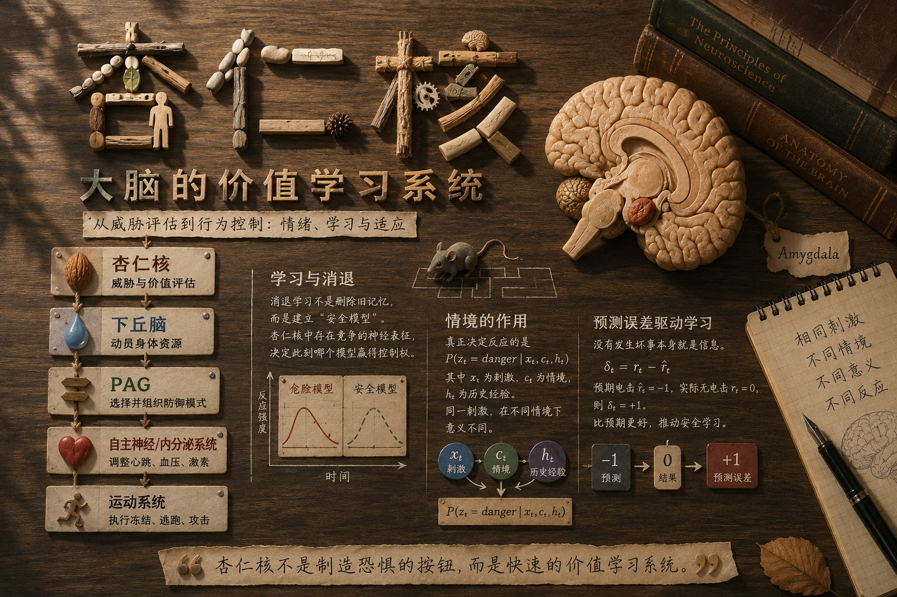

<!-- wordm:lang zh -->

读萨波斯基的《行为》，前菜刚吃完，第一盘正菜就是杏仁核。我觉得这个安排有两个原因。一是整本书关心暴力、恐惧、冲动这些行为从哪里来，而杏仁核正好处在这些问题的交汇处；二是从情绪进入行为，比直接从高级认知讲起顺畅得多。

前菜里，萨波斯基先搭了一个很粗略的三级大脑模型：较低层控制身体，中间层组织情绪和动机，更高层参与计划、抑制与抽象思考，大体上从脖子一路延伸到额头。这个模型在解剖学上当然不能当成严格分层，但作为理解行为的脚手架很好用。身体并不是等大脑下达命令才行动，内脏、激素、肌肉状态也不断反过来影响大脑。下丘脑正好位于这种身体调节和情绪控制的交界处，而杏仁核又大量影响下丘脑。因此，杏仁核很适合作为理解“一个刺激如何一路变成身体反应和行为”的入口。

## 情绪相关

杏仁核位于左右两侧颞叶深部，长期以来最著名的标签是恐惧、焦虑和攻击。早期大量动物实验以及一些人体研究都发现，当个体面对威胁、社会竞争或可能受到伤害时，杏仁核的活动会增强；损伤杏仁核往往会削弱部分恐惧和攻击反应，而刺激某些杏仁核区域，则可能增强防御性或攻击性行为。

但把杏仁核简单称作“恐惧中心”很快就会碰到问题。它不仅会对已经发生的坏事反应，还特别容易被**可能发生、但尚未确定的坏事**调动。

例如，让实验者在虚拟环境中看到一个会产生电击的威胁逐渐靠近，威胁越近，杏仁核等区域的活动越强；如果潜在电击更剧烈，同样程度的神经反应会在更远距离就出现。另一类实验不让被试知道电击什么时候到来，仅仅让他等待，随着这种悬而未决的状态持续，相关威胁网络的活动也会变化。

社会情境里也有类似现象。一只雄性恒河猴看见竞争者接近自己的配偶，会出现抓挠、磨牙等紧张行为，同时杏仁核活动上升；人在竞争中面对不断波动、无法预测的排名时，也可能出现类似反应；甚至面对群体意见时，如果自己坚持一个与所有人不同的判断，杏仁核也可能参与其中。

这些例子共同指向的东西，比“恐惧”更宽。杏仁核似乎特别关心一个问题：

**眼前这个东西，对我究竟意味着什么？**

尤其当答案牵涉威胁、收益、社会评价，而且结果还不确定时，它会迅速介入。

## 从不确定性到行为

因此，与其把杏仁核理解成一个储存“害怕”情绪的盒子，不如把它暂时看成一个快速的**生物价值评估器**。它接收来自感觉系统和其他脑区的信息，判断某个刺激是否值得立即提高警戒，然后把这种评估传给更低层的身体控制系统。

一条经过高度简化的防御通路可以写成：

$$
\begin{array}{c}
\boxed{
\begin{array}{c}
\textbf{杏仁核} \\
\text{威胁与价值评估}
\end{array}
}
\\[6pt]
\Downarrow
\\[6pt]
\boxed{
\begin{array}{c}
\textbf{下丘脑} \\
\text{动员身体资源}
\end{array}
}
\\[6pt]
\Downarrow
\\[6pt]
\boxed{
\begin{array}{c}
\textbf{PAG} \\
\text{选择并组织防御模式}
\end{array}
}
\\[6pt]
\Downarrow
\\[6pt]
\boxed{
\begin{array}{c}
\textbf{自主神经 / 内分泌系统} \\
\text{调整心跳、血压、激素}
\end{array}
}
\\[6pt]
\Downarrow
\\[6pt]
\boxed{
\begin{array}{c}
\textbf{运动系统} \\
\text{执行冻结、逃跑、攻击}
\end{array}
}
\end{array}
$$

下丘脑在这里很像一个身体状态控制器。威胁升高以后，它可以通过自主神经和内分泌系统改变心率、血压、激素水平以及能量分配，同时还参与攻击、摄食、交配等基本动机。于是动物不只是“知道危险”，整个身体会一起切换到另一种运行模式。

再往下是 PAG，也就是导水管周围灰质。到了这一层，问题已经不是抽象的“危险不危险”，而变成了“现在具体应该怎么防御”。不同 PAG 亚区参与冻结、逃跑、主动防御、疼痛抑制等模式。捕食者还比较远时，动物可能降低动作、持续观察；捕食者突然逼近时，策略可能切换成逃跑；如果退路被彻底堵死，则可能出现防御性攻击。

所以可以把 PAG 粗略想象成一个低层策略控制器，选择的变量不是“左腿哪块肌肉收缩多少”，而是整个行为模式：$m_t\in{\text{freeze},\text{flight},\text{fight},\ldots}$

这样再回头看攻击行为，它和不确定性的关系就比较清楚了。并不是说“暴力就是不确定性的宣泄”，而是当系统把不确定性解释为逼近的威胁，同时逃避空间又逐渐减少时，攻击可能成为防御策略集合中的一个选项。杏仁核参与的是前面的价值判断，真正的行为则是多个层级共同作用的结果。

## 学习：一个无害声音怎样变成威胁

真正让杏仁核变得有意思的，是它并非只处理天生就危险的东西。很多刺激的意义，是后天学出来的。

杏仁核内部包含多个核团，其中最常讨论的一组是基底外侧杏仁核复合体，也就是 BLA，以及更靠近输出端的中央杏仁核 CeA。把它们简单说成“BLA 负责后天学习，CeA 存储先天或长期恐惧”并不准确，但可以先抓住一个大致分工：BLA 特别适合把刺激、情境和结果建立联系，而 CeA 更接近把这些价值信息转换成自主神经、内分泌和防御行为输出。

经典的恐惧条件作用实验非常简单。先播放一个本来没有意义的声音，随后给老鼠一次轻微电击：

**声音 → 电击**

第一次听见声音时，它没有理由害怕。但重复多次以后，声音本身就足以让动物冻结。也就是说，系统逐渐学到了一个新的条件概率：

$P(\text{shock}\mid\text{tone})$

变得很高。

这种学习伴随着 BLA 内部突触强度的改变。原本只是一个中性声音的感觉表征，因为反复与电击共同出现，逐渐获得了负面价值。随后这些已经学会的价值信息可以更有效地驱动 CeA，以及更下游的下丘脑和 PAG。

于是同一条防御通路发生了一个关键变化：先天系统本来只会对具有生物意义的威胁作出反应，但学习可以把一个任意刺激接入这条通路。

声音本身没有变，变的是它在神经系统里的**意义**。

## 消退不是删除

更反直觉的事情发生在消退学习中。

如果声音已经让老鼠学会害怕，现在反复播放这个声音，却不再给予电击，人最自然的猜测是：以前增强的“声音→电击”连接逐渐削弱，最后回到学习之前的状态。

但实际情况通常没有这么简单。

旧的恐惧关联可以继续存在，同时系统建立另一套与“现在安全”有关的神经表征。2008 年 Herry 等人在小鼠基底杏仁核中观察到两类活动模式不同的神经元：一类更活跃于高恐惧状态，另一类更活跃于消退后的低恐惧状态；当动物在恐惧和安全状态之间切换时，两群神经元的活动也随之变化。

因此，杏仁核内部不一定只有一个连续变量 $fear\in[0,1]$，然后把这个数字从 0.9 慢慢调到 0.1。它更像可能同时保留着几套竞争性的解释：

**这个声音意味着危险。**

以及：

**这个声音在现在这个情境下是安全的。**

这就解释了一个重要现象：

**恐惧反应消失，不等于恐惧记忆消失。**

前额叶皮层会参与消退记忆的形成和提取；BLA 与中央杏仁核之间还存在大量抑制性中间细胞，可以压制部分恐惧输出；中央杏仁核内部本身也存在复杂的抑制性微回路。因此，与其说消退是“额叶踩刹车、杏仁核踩油门”，不如说整个网络进入了另一种状态，使安全表征暂时获得了行为控制权。

这个过程可以稍微数学化一点。动物最初学到的是：

$P(\text{shock}\mid\text{tone})$

很高。

如果随后不断出现“tone，但是没有 shock”，系统并不一定只做一件事——把这个概率直接改低。它还可能推断：**世界状态变了。**

假设存在一个潜在状态 $z$，那么过去可能处于：

$z=\text{danger}$，

而现在处于：

$z=\text{safe}$。

此时需要学习的就不只是 $P(\text{shock}\mid\text{tone})$，而是：

$P(\text{shock}\mid\text{tone},z)$。

问题由“这个声音危险吗”变成了：

**在当前状态下，这个声音意味着什么？**

## 情境决定哪段记忆取得控制权

这种解释马上能够说明恐惧消退里最奇怪的一组现象。

假设老鼠在房间 A 中学习：

**声音 → 电击**

然后换到房间 B，反复播放声音，但不再电击。最后老鼠在 B 中已经几乎不害怕这个声音。

如果消退真的把旧记忆删除了，那么把它重新放回 A，理论上也不应该害怕。但实际上，恐惧可能重新出现，这叫 renewal。

即使一直待在原来的消退环境里，仅仅经过较长时间，恐惧也可能部分恢复，这叫 spontaneous recovery；如果消退以后重新经历一次电击，即便这次电击并没有跟声音一起出现，旧的声音恐惧也可能重新被唤起，这叫 reinstatement。

这些现象都说明旧模型仍然存在。

海马在这里就非常重要，因为它特别善于表示“我现在在哪里”“当前是什么情境”。如果把当前感觉刺激写成 $x_t$，情境写成 $c_t$，过去经验写成 $h_t$，那么系统真正需要估计的可能不是简单的：

$P(\text{danger}\mid x_t)$，

而更接近：

$P(z_t=\text{danger}\mid x_t,c_t,h_t)$。

同一个声音 $x_t$ 完全没有变化，仅仅换了房间、时间，甚至改变了内部生理状态，系统对于当前究竟处在“危险世界”还是“安全世界”的判断都可能变化。

于是杏仁核、海马和前额叶可以形成一种很有意思的分工：BLA 保存和更新刺激的价值关系，海马提供当前情境，前额叶参与更长时间尺度上的控制与消退记忆提取，而下游回路决定哪一种反应真正变成身体行为。

## “没有发生”本身也是信息

消退还有另一层值得注意的地方。

“没有被电击”看起来好像什么事情都没发生，但如果动物本来确信电击会发生，那么**没有发生本身就是一个强烈事件**。

假设动物预计接下来会得到一个负价值结果：

$\hat r_t=-1$，

实际上却什么都没有发生：

$r_t=0$。

那么最简单的预测误差就是：

$\delta_t=r_t-\hat r_t=+1$。

这是一个正向预测误差。它表示：

**结果比我预计的更好。**

因此安全学习并不是在处理“空白信息”，而是在处理持续出现的预测失败：我以为坏事会发生，但它一次又一次没有发生。

这也解释了为什么一次没有电击通常不会立刻消除恐惧。一次预测失败至少有两种解释：

**第一种：我以前的模型错了，这个声音其实不危险。**

**第二种：模型仍然正确，只不过这一次碰巧没发生。**

只有随着第二种解释越来越难维持，系统才有理由建立或者加强“当前是安全状态”的模型。

从这个角度看，杏仁核参与的不只是条件反射，而是一种非常基本的学习问题：**当现实与预测冲突时，究竟应该修改旧模型，还是认为环境已经进入了一个新状态？**

## 甚至可以修改旧记忆

普通消退主要表现为新旧模型竞争，但还有一种更激进的可能：旧记忆本身被更新。

一个已经稳定的恐惧记忆，在被重新唤起之后，有时会短暂进入不稳定状态，需要再次经历“再巩固”。如果恰好在这个窗口里给予新的经验，新信息就有可能进入旧记忆，而不只是额外建立一条安全记忆。

Monfils 等人在大鼠、Schiller 等人在人类中都发现过这种现象：先短暂唤起恐惧记忆，再在一定时间窗口内进行消退，之后某些情况下恐惧恢复会比普通消退更弱。

不过，再巩固并不是一个可以随意调用的“记忆覆写接口”。记忆有多强、形成多久、重新唤起时是否产生足够的预测误差，都可能影响它会不会进入可修改状态。因此今天更稳妥的理解不是“旧记忆可以被轻易删除”，而是：**记忆在某些条件下并不像写入硬盘以后永久只读，它仍然可能重新开放更新。**

## 总言

走完这一圈以后，杏仁核最值得保留下来的形象已经不是“制造恐惧的小杏仁”。

它更像一个快速的价值学习系统。

感觉系统告诉它“发生了什么”，海马补充“这发生在哪里、现在是什么情境”，前额叶带来更长时间尺度上的模型和控制，而杏仁核网络不断学习：

**在当前状态下，这个东西对我意味着什么？**

当答案指向迫近的威胁时，它可以通过中央杏仁核、下丘脑和 PAG 迅速调动身体，最终形成冻结、逃跑或者攻击；当新的证据反复证明威胁没有出现时，它又可以形成与旧恐惧竞争的安全表征。

于是恐惧、焦虑乃至部分攻击行为都不再需要被理解成几个孤立的“情绪按钮”。它们更像一个持续推断世界状态、学习刺激价值并据此控制身体的系统，在不同条件下呈现出的不同结果。
