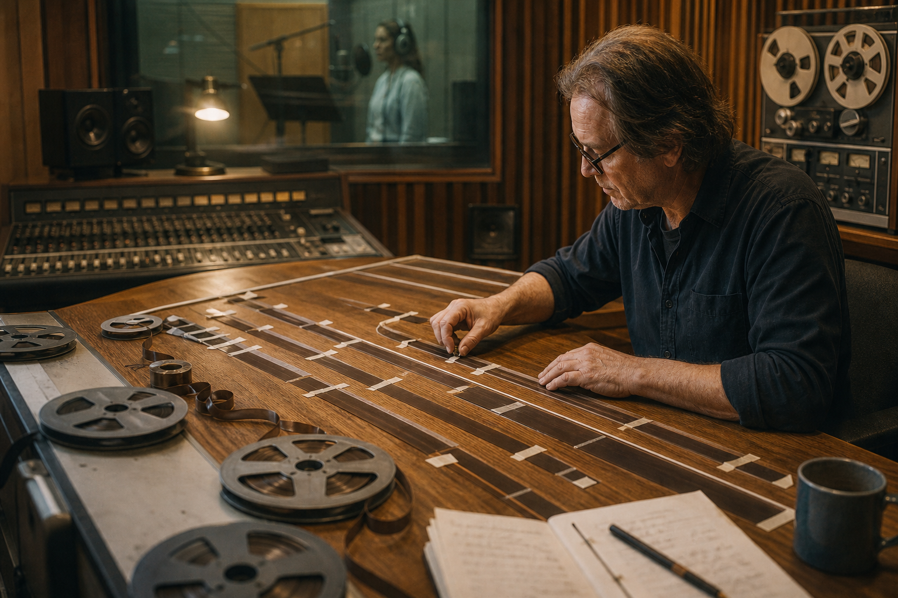
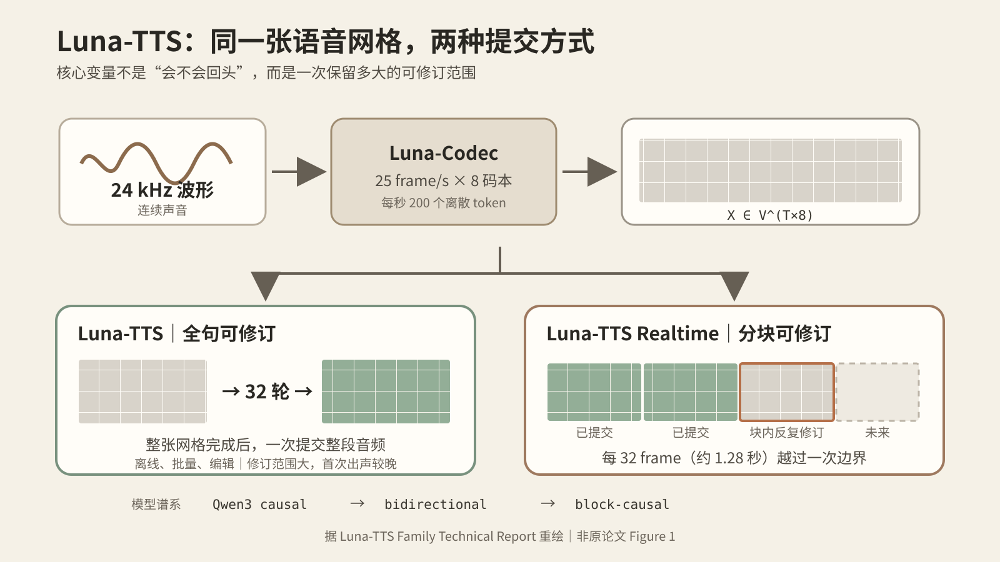

<!-- wordm:lang zh -->

*Luna-TTS 看起来在解决声音如何生成，真正触及的却是一个更普遍的问题：一个智能系统应当把候选结果保留多久，又应当在什么时候承担“已经来不及改”的代价。*

*图 1｜真实录音棚。声音并不是文字换一种载体，而是一场需要在时间上整体组织的表演。摄影：Hc Digital，来源：[Unsplash](https://unsplash.com/photos/a-recording-studio-with-microphones-headphones-and-microphones-g0PcDhany4Y)，依 Unsplash License 使用。*

今天的大模型已经非常擅长向前生成。写文章时，它一个 token 接一个 token；做 Agent 时，它观察环境、形成判断、调用工具，再把新的结果接到历史末端。我们甚至逐渐把这种单向推进当成了智能本身：过去不断增长，未来从过去的尾部展开。2026 年 8 月 12 日发布的 Luna-TTS 提出了一个值得注意的反例。它原本只想改变语音生成，却逼出了一个更一般的判断：如果一个结果的各部分高度牵连，过早把局部决定写死，本身可能就是一种错误的计算方式。

这项工作目前只是一份刚公开的 v1 技术报告，尚不能把作者自报的指标视为独立复现后的定论；但它提出的问题很清楚。Luna-TTS Family 从 Qwen3-0.6B 出发，沿着 `causal → bidirectional → block-causal` 连续训练，得到离线的 Luna-TTS 与流式的 Luna-TTS Realtime。

两者共用 tokenizer、数据管线和 0.6B 主干，并在约 100 万小时中、英、日、韩语音上预训练。它不是给传统 TTS 再外挂一个情绪模块，而是在重新安排“哪里还能修改、哪里必须提交”。详见 [Luna-TTS Family Technical Report](https://arxiv.org/abs/2608.11593)。

## 不是更会说，而是更晚承诺

传统自回归语音模型把整段声学 token 写成 $X=(x_1,\ldots,x_N)$，再作分解 $p(X\mid c)=\prod_i p(x_i\mid x_{<i},c)$，其中 $c$ 是文本与参考声音。这里容易产生一个误解：自回归模型并非看不到句尾文字，它能读完整段文本；真正的限制在生成侧。一个声学 token 一旦进入 prefix，后续模型只能接受它，不能因为五秒后的语气发生变化，就把五秒前的起音重新说一遍。强模型可以提前规划全句，但它必须尽量一次规划正确。

声音偏偏不是一串彼此独立的字。说“我没事，你先走吧”时，释然、恼怒或故作轻松，并不是最后给每个字贴一个 emotion tag。语速、基频、强弱、停顿、气声、句尾衰减乃至一次吸气，会跨越数百毫秒甚至整句话，共同构成一次表演。句尾如何落下，可能反过来决定句首该怎样起音。因此局部变量 $x_i$ 的合适取值经常依赖相距很远的 $x_j$。自回归并非做不到这种长程协调，只是它主要依赖预见；Luna 增加的则是事后修订的权利。

*图 2｜把全句留在工作台上。Luna-TTS 更像先铺开整段磁带，再反复调整各处关系，而不是录下一个词就把母带封存。AI 生成图。*

Luna 首先把声音变成适合联合修订的对象。Luna-Codec 将 24 kHz 波形压缩为每秒 25 个 frame，每个 frame 由 $Q=8$ 个 residual codebook token 表示，每个 codebook 有 2048 个条目。于是语音成为二维网格 $X\in\mathcal V^{T\times 8}$：横轴是时间，纵轴是残差码本深度，总计每秒 200 个 token、约 2.2 kbps。

时间确实有先后，码本深度却没有天然的“第一层必须先于第二层生成”的物理因果。八枚 token 是同一帧声音的残差描述，各层彼此相关，却不自带唯一的线性顺序。把整张网格硬拉成一条序列，是建模选择，而不是声音自身的秩序。

*图 3｜同一张语音网格的两种提交方式。全句版在整张网格上反复修订，实时版则按 1.28 秒分块提交。依据 [Luna-TTS 原始技术报告](https://arxiv.org/pdf/2608.11593) 重绘。*

Luna-TTS 采用 absorbing-state masked diffusion。若 $X_0$ 是干净语音网格，在噪声强度 $t\in(0,1]$ 下，每个位置以概率 $t$ 被替换为 MASK，即 $q_t(X_t^{i,q}=M\mid X_0)=t$。模型学习在文本、参考声音和其余可见 token 的条件下，同时恢复所有被遮住的位置。

推理则从全 MASK 的 $T\times8$ 网格开始。每一轮同时预测所有空位，先固定高置信度部分，再让不确定位置进入下一轮。论文默认用 $S=32$ 轮 refinement；重要的不是数字 32，而是每个 $X^{(s)}$ 都仍代表整段声音，句首与句尾在交付前都还可以彼此校正。

因此 Luna-TTS 的体验更像“输入整句话—等待整段生成—得到完整音频”，而不是边算边播。它需要外部 duration predictor 先估计帧数 $T$，却也因此能在输出前反复协调全句，还天然支持 infilling：固定前后语音，只重做中间一段。

Luna-TTS Realtime 则把声音切成 32 frame、约 1.28 秒一块，使用 $p(X\mid c)=\prod_b p(X^{(b)}\mid X^{(<b)},c)$。块之间按时间前进，块内部仍并行去噪；一块完成便进入 KV cache 并开始播放，之后不能再改。

这一区别不是“完整版不完善，所以又补了实时版”，而是同一矛盾的两个答案：Luna-TTS 的可修订范围大，第一次出声较晚；Realtime 的可修订范围小，却能尽早出声。它们不是高低版本，而是针对不同交付压力选择的两个 operating point。

在[原报告的 warmed 本地测试](https://arxiv.org/html/2608.11593#S5.SS2)中，排除网络传输、双 H20 并行 CFG 条件下，Realtime 生成首个 1.28 秒音频块用时 41.6 ms；而在 CV3-Eval 的困难子集上，它又明显落后于全句版。数字仍待复现，但关系很稳定：越早提交，越早失去纠错空间。

## 从语音到 Agent：先分清候选世界与真实世界

今天常见的 Agent 仍带着强烈的自回归时间观。若历史为 $h_t$，Agent 产生动作 $a_t\sim\pi_\theta(\cdot\mid h_t)$，环境随后变为 $s_{t+1}=T(s_t,a_t)$。一旦环境接受这个动作，它就进入了不可改写的历史。

[ReAct](https://arxiv.org/abs/2210.03629) 让推理与行动交替，使模型能根据外部信息更新计划；[Reflexion](https://arxiv.org/abs/2303.11366) 又让它把失败写成语言反馈，改善下一次尝试。这些工作都很重要，但外部动作若已经改变世界，后来的反思只能补救，不能把那段现实删除。

Luna 对 Agent 真正有价值的启发，不是“把 LLM 换成 diffusion model”，而是把候选状态与现实状态明确分开。令 $z^{(k)}$ 表示第 $k$ 轮仍可编辑的方案，$s_t$ 表示已经发生的外部状态，系统执行 $z^{(k+1)}=R_\theta(z^{(k)},s_t,c,V(z^{(k)}))$，在内部持续修订候选解。

这里 $c$ 是目标与约束，$V$ 是测试、编译器、模拟器、视觉比较器或人工反馈，$R_\theta$ 则利用这些证据修订方案。只有显式调用 commit 算子时，候选方案才通过 $s_{t+1}=C(s_t,z^{(k)})$ 进入现实。

这组对应关系并不神秘：语音网格相当于 Agent 的计划图、代码库或文档；MASK 是尚未解决的变量；denoise 是“生成—检查—修订”；confidence-based unmasking 是把已通过约束的部分暂时冻结；block-causal 则像事务边界，上一块已经提交，当前块仍能重写。

真正的变化不发生在模型参数里，而发生在状态语义里。一个成熟系统至少应区分 `proposed → provisional → verified → committed`。否则所谓“反思”常常只是模型说了一遍自己后悔，却没有任何可回滚对象。

代码 Agent 最容易看出这种差异。线性 Agent 可能改完一个文件就继续向前，把早期接口当成既定事实；可修订 Agent 会先在 branch 或 snapshot 中形成跨文件 patch，运行测试，依据失败同时重写若干模块，最后才 merge。Git、沙箱和测试框架已经提供了这种基础设施。

[SWE-agent](https://arxiv.org/abs/2405.15793) 表明，Agent 与计算机之间的接口设计会显著改变其行为。沿着 Luna 的视角继续推进，下一步的接口不只要让模型“能调用什么命令”，还要告诉它“哪些状态可撤销、哪些证据足以提交”。

这里需要把两个判断分开。第一，任务是否值得做迭代修订，要看变量是否存在强全局耦合、中间结果能否低成本修改，以及是否有评价或约束信号。复杂代码、长文、网页、CAD 和研究方案通常满足这些条件。第二，既然要修订，一次允许修改多大范围，则由延迟和不可逆性决定。离线生成整站可以像 Luna-TTS 那样保留大范围编辑权；发邮件、下单或控制机器人却必须像 Realtime 一样缩短区块，并在每次越过边界前增加确认与风险控制。

*图 4｜提交边界。左侧已经胶合封固，中段仍由夹具保持可调，右侧尚是散件与草图。过去、当前与未来不必共享同一种状态。AI 生成图。*

这也让 Agent 与模型预测控制产生了自然联系。Agent 在时刻 $t$ 不只猜下一个动作，而是维护有限未来 $A_t=(a_{t\mid t},\ldots,a_{t+H-1\mid t})$，根据当前状态重新优化整段候选计划，却只执行最前面的 $b$ 个动作；得到新反馈后，窗口前移并再次求解。

这个“反复规划有限未来、只提交最前一小段”的结构，正是 receding-horizon control 的基本思想，可参见 [MIT 的 Model Predictive Control 讲义](https://ocw.mit.edu/courses/16-323-principles-of-optimal-control-spring-2008/resources/lec16/)。Luna 提供的不是 MPC 本身，而是生成式解释：过去凝固，当前去噪，未来保持开放。

## 新方向不是永远反悔，而是学会怎样承诺

因此，editable horizon $H$ 与每次提交长度 $b$ 会成为 Agent 架构里的核心变量。可以把设计目标压缩为 $J(H,b)=\mathbb E[L_{task}]+\lambda L_{first}+\mu C_{irrev}+\nu C_{compute}$：四项分别表示任务损失、首次响应延迟、错误提交的不可逆代价，以及反复搜索的计算成本。

增大 $H$ 往往给全局协调更多空间，却增加延迟与算力；增大 $b$ 可以减少交互开销，却会让更多未经新反馈检验的动作一起进入现实。不存在对所有任务都最优的窗口。所谓 Agent 架构设计，很大一部分正是在不同场景下为这两个量定标。

“允许修改”也不天然等于“越改越好”。语音扩散有明确的干净样本和训练目标，而开放世界 Agent 常常没有可靠的 $V$：测试可能覆盖不足，模拟器可能偏离现实，LLM verifier 也可能与生成器共享盲点。若系统只会围绕错误评价函数反复优化，它得到的不是更深思熟虑的答案，而是更彻底的过拟合。另一个风险是永不提交：只要继续搜索总可能发现更好的方案，Agent 就会把谨慎变成拖延。因此超时、预算、最小改进阈值和人工确认不是工程杂项，而是承诺机制的一部分。

这个边界也提醒我们，不应把 Luna-TTS 的成功直接当作 Agent 架构已经被验证。语音 token 位于固定网格，codec decoder 基本确定；Agent 面对的状态空间开放、动作类型异质，而且真实世界通常不存在逆函数 $T^{-1}$。已发送的邮件只能再发澄清，已经发生的交易只能做补偿操作。我们真正能移植的是原则：在可逆空间里尽量联合修订，在不可逆边界前提高证据门槛，并让提交范围随风险和时延动态变化。

沿着这条线看，Agent 的下一步未必首先是一个“更会思考”的基础模型，而可能是一套更成熟的时间制度：冻结目标与硬约束，让假设、计划和工作产物保持 provisional；用环境反馈持续消除不确定性；把通过验证的局部逐渐固化；只在必要时把结果提交到外部世界。这样的 Agent 不再只是沿历史续写下一步的叙述者，而更像一个持续运行的优化器，始终维护候选世界，并清楚知道哪一部分仍是草稿。

Luna 最值得带出语音领域的认识，也正在这里。智能不只表现为能否迅速给出下一个 token、下一次调用或下一个动作；它还表现为能否区分“现在看起来对”与“已经必须算数”。真正可靠的 Agent 既不能永远往前冲，也不能永远留在草稿里。它需要一种有边界的反悔能力：在还能改的时候充分修改，在必须做的时候明确承诺。

---

*资料说明：Luna-TTS 的架构、训练规模、推理设置与指标均来自 2026 年 8 月 12 日公开的 v1 技术报告，本文写作时间为 2026 年 8 月 14 日。Agent 部分是基于该机制与既有 Agent、MPC 工作所作的架构推演，不是 Luna-TTS 作者在论文中提出或验证的结论。*
