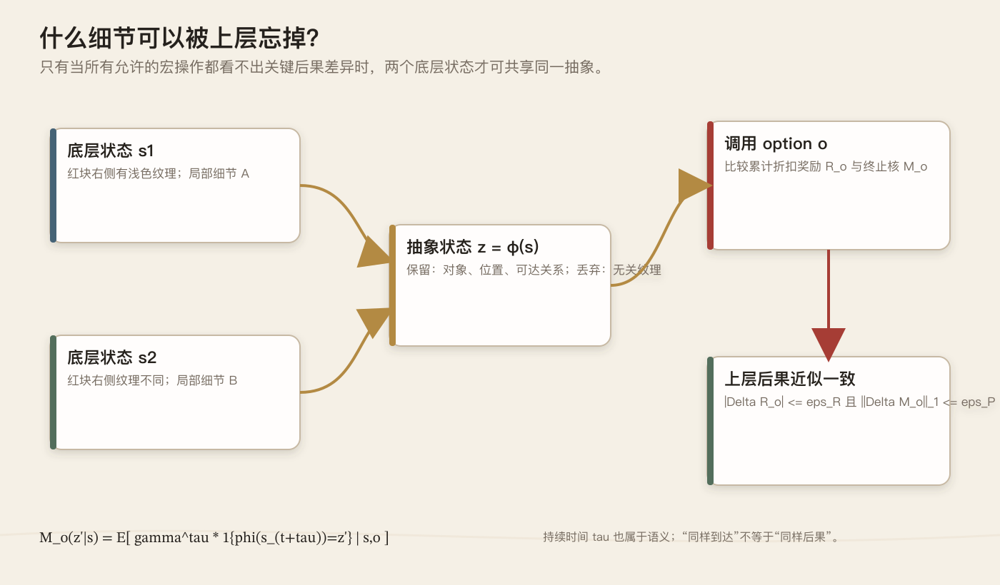
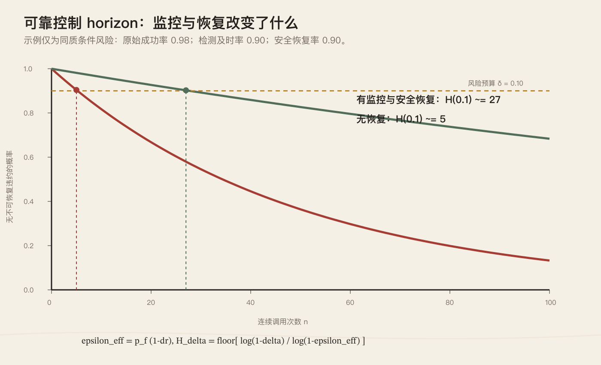
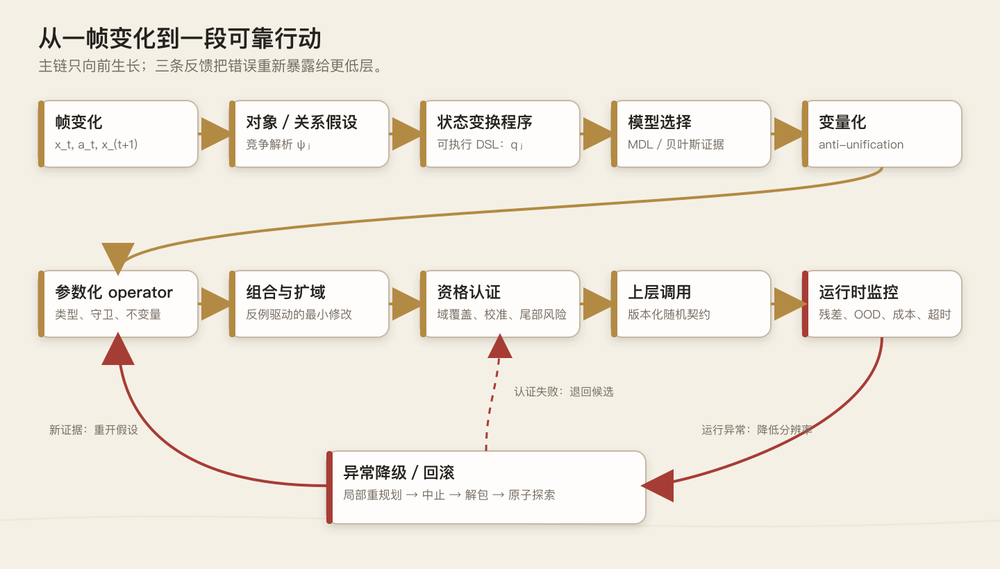

<!-- wordm:lang zh -->

> 可组合性让能力增长，可信的抽象才让能力穿过时间。

*图 1　认知工作台。简单变换可以被组合成更大的机构，但每一次封装都必须携带证据、边界与返回路径。AI 生成，内置图像生成工具。*

## 一、零件越多，机器为何越不可靠

想象一块铺着浅色方格的木板：四枚红色木片紧挨成一个二乘二方块，按下右箭头后，它们整体向右滑了一格。人几乎不会逐枚记忆“第一个格子消失、第五个格子变红”，而会说“红色拼片移动了”。可对一个从像素开始学习的系统，真正困难的正是这次压缩：四枚木片为何属于同一对象，变化为何是平移而非删除后重建，右箭头又在什么条件下触发它？

于是很自然会想到，给系统一套可以不断组合的零件：选择格子、建立分组、改变坐标、设置属性、创建、删除、条件分支，再让旧程序成为新程序的原子。这样做确实扩大了表达能力，却也制造了全文的核心矛盾：函数越多，候选解释以组合方式增长；层级越深，底层一次微小误判越容易被上层当作事实。目标不能只是“任何东西都能组合”，还必须规定什么东西有资格被复用。

把它想成一张机械工作台更合适。底层代理像夹具，能把红色拼片送到目标位置；上层代理只看见夹具的入口和出口，于是可以指挥更远。但若每次宏操作成功率都是 $0.98$，连续五十次且中途不可恢复，整条计划成功的概率只有 $0.98^{50}\approx0.364$。封装没有消灭误差，只是把误差藏进盒子并沿时间累积。抽象让控制距离变长，也让一次判断必须承担更久的后果。

因此，一个有资格被上层调用的 operator 不能只是确定函数 $y=f(x)$，而应像带检测仪表的机械模块：它声明何时可用、承诺哪类结果、给出结果分布与成本，并在信号越界时中止。若红色拼片前方突然出现挡块，`Move(piece,right)` 不应悄悄返回“完成”，而要报告“前提失效、置信度下降、已停在安全状态”。上层依赖的不是下层永不犯错，而是下层能识别自己何时可能错。

这也给出了整套系统的主线：先从相邻帧差异提出对象与关系假设，再把变化写成可执行程序；多个具体程序若只在少数常量上不同，便把常量变量化，形成参数化 operator；operator 经组合得到更长的模式，经新情境检验后扩大适用域；只有通过资格认证者才进入上层代理。运行时仍持续比较预测与现实，异常时降级到更细粒度的动作。层级不是一座塔，而是一组会晋升、冻结、回退和重建的工作台。

## 二、ARC-3 把智能从答案移到时间

ARC-AGI-3（下文简称 ARC-3）把这个矛盾变成了可观察的实验。它不再给出若干输入—输出样例，等待模型填一张最终网格，而把测试者放进陌生的回合制环境：规则、目标乃至胜利条件都不明说，测试者必须一边行动，一边发现什么可控、什么值得记忆、下一步应验证哪个假设。[官方技术报告](https://arcprize.org/media/ARC_AGI_3_Technical_Report.pdf)把重点放在探索、建模、目标设定与规划执行。

ARC-3 的观测是 $64\times64$、16 色的抽象画面；正式基准由 25 个公开演示环境、55 个半私有环境和 55 个完全私有环境组成。私有集相对公开集刻意保持机制上的分布外差异，所以这里的“未见”有明确边界：它测试的是同一抽象交互域中的新环境与新组合，不等于任意现实世界泛化。[官方数据说明](https://www.kaggle.com/competitions/arc-prize-2026-arc-agi-3/data)

它还把答案放进了成本之中。当前评分用首次接触时的人类中位行动数作基线；探索与执行动作都计数，而模型内部推理或工具调用不计环境动作。于是碰巧试到终点，与用少量探针建立模型后高效执行，会得到不同评价。这是一项经过人类归一化的交互效率信号，却不是完整的计算效率或长期稳定性度量。[评分方法](https://docs.arcprize.org/methodology)

回到红色拼片：第一次按右键，只能确认画面变了；第二次在边界旁尝试，才可能发现平移会被阻挡；再换一块不同形状的拼片，才知道规则依赖颜色、连通性还是共同运动。每个动作既可能推进任务，也是一项实验，而实验会消耗行动预算。好的代理必须在“收集更多证据”和“利用现有模型”之间下注，并保留推翻旧解释的余地。

Tufa Labs 的第一次公开回答是 2025 年预览赛系统 StochasticGoose。它没有先学出“钥匙”“门”或“移动”，而用卷积网络预测某个动作是否会让下一帧变化，再把探索偏向更可能产生信息的位置；在预览赛中，它以 12.58% 得分和 18 个完成关卡列第一。结果有限却很清楚：系统主要仍是受引导的搜索，不足以证明理解了世界；但在未知环境里，先学会哪些试探会带来信息，已经比均匀乱试更有效。[代码与说明](https://github.com/DriesSmit/ARC3-solution)

2026 年首个里程碑赛，Tufa 转向 The Duck：Qwen 3.6 27B 在 Python REPL 中写代码、调用函数、采取动作、读取结果，再修正临时模型。它可在渲染图、ASCII 网格和预先分割的对象表之间选择观察方式，并通过淘汰旧消息、保留同局摘要维持长时间交互。[Tufa 技术说明](https://tufalabs.ai/research/duck-harness/)显示，这个公开实验在 25 个游戏、每个 20 次运行上的均分为 $1.6002\pm0.4475$，不同游戏间表现很不均匀。

The Duck 展示了“把解释写成可执行结构”的力量，却没有实现本文要讨论的完整制度。发布代码中的 Python 调用每次从空白环境开始；每局保留的是轨迹与文本式世界摘要，而不是带类型、适用域、校准置信度、认证状态和版本号的跨环境 operator registry。[开源实现](https://github.com/Tufalabs/duck-harness)因而更适合作为现实起点：局部可执行解释已经出现，但它还没有自动变成可长期托付的抽象接口。

里程碑第一名也不等于 ARC-3 已被解决。官方正式评测明确警惕针对基准注入大量专用脚手架，因为那可能测到人类预装的策略，而非系统在首次接触时获得技能的能力。[官方测试政策](https://arcprize.org/policy)给出的真正问题是：代理能否在行动预算、上下文预算与不确定性之中，持续形成模型、暴露错误并重新取得控制。接下来要追问的，不是它能否描述红色拼片，而是它怎样把一次帧变化锻造成可组合、可认证、也可撤销的模式。

## 三、从帧的变化中发现“发生了什么”

在 ARC-3 里，智能体面对的不是一张静止的找规律题，而是一串由自己的动作参与制造的画面。它在 $t$ 时刻看见原始帧 $x_t$，执行动作 $a_t$，随后得到 $x_{t+1}$；真正困难的不是描述哪里不同，而是找到一个能重演这次变化、还能预测下一次变化的解释。若结构化状态为 $y_t$，解释便是一段程序或随机核 $q:(y_t,a_t)\mapsto\hat y_{t+1}$。标签总结过去，程序才对未来承担承诺。

设画面中央有一块红色二乘二拼片，按下 RIGHT 后，它整体向右一格。最直接的证据是变化支持集 $\Delta_t=\{p:x_t(p)\neq x_{t+1}(p)\}$：左缘若干红格消失，右缘同样数量的红格出现。但帧差本身不含因果性；“同一物体平移”“旧图形删除后在别处复制”“背景坐标系整体左移”都能解释这一次观测。若系统过早把差分命名为 Move，它便把待发现的结构偷偷写进了词典。

竞争首先发生在“什么算一个对象”上。红格可以按同色且连通组成假设 $H_1$，按所有同色格组成 $H_2$，也可以让暂时分离、却始终刚性共动的格子组成 $H_3$；边界、孔洞、包含与接触又会产生不同关系假设。系统因而不保存唯一对象表，而保存带权候选集 $\{(H_i,w_i)\}$。下一帧到来时，它比较各假设对位置、形状与关系变化的预测，再更新权重。

红色拼片之所以逐渐取得“同一对象”的身份，不只因为格子相邻，更因为内部关系跨时间保持。若候选集合 $S$ 中任意两格满足 $p_i(t)-p_j(t)\approx p_i(t+1)-p_j(t+1)$，刚性共动假设便得到支持；若它越过遮挡后仍恢复原形，支持会进一步增加。近似号必须保留：遮挡、过渡动画与观测噪声都可能制造短暂缺格。一次不一致应降低后验，而不是让对象立刻“死亡”。

*图 2　对象不是预先给定的分割结果，而是多帧变化下彼此竞争的解释。AI 生成，内置图像生成工具。*

当候选对象和关系增多，原始网格可暂时提升为关系状态 $G_t=(V_t,E_t)$：节点记录拼片的掩码、锚点与存在概率，边记录邻接、包含、遮挡或接触。然而 $G_t$ 仍不是世界本身。若相同表面帧因历史不同而有不同未来，当前帧就不具马尔可夫性；结构状态应写成 $y_t=\psi(x_{0:t},a_{0:t-1})$，把记忆、对象身份或对隐藏状态的信念纳入其中，而不是让更复杂的 operator 掩盖状态缺失。

部分可观测性使“多看几帧”并不总够，因为被动历史可能永远无法区分两条机制。此时动作本身应成为实验。若系统仍无法判断拼片是相对平移还是跳到固定槽位，按 LEFT、在边界旁按 RIGHT，或先接近障碍再试，都会产生不同诊断力。可用 $a^*=\arg\max_a\{\mathbb E[U(a)]+\lambda I(H;x_{t+1}\mid a)-\rho\,\mathrm{Risk}(a)\}$ 选择动作；早期一次无收益探针，可能省下后续几十次盲试。

实验所得证据最终要落进可执行表示。底层 DSL 不必预装“物体”或“推动”，只提供 `GROUP`、`SELECT`、`TRANSFORM_COORD`、`SET`、`CREATE/DELETE`、`RELATE`、`IF` 与 `COMPOSE` 等原语。红色拼片的一种临时解释是先选出共动红格集合，再把所有坐标统一加上 $(0,1)$。内部可以完全没有“移动”这个词；语义来自程序执行后产生什么，而非它叫什么。

这一步把解释从自然语言判断改造成程序检验。系统无需断言“红色方块向右移动”，只需检查选择器是否找对格子、坐标变换是否保留形状，以及渲染结果是否接近观测。失败也因而可定位：选择器错，说明对象假设有问题；位移向量错，说明参数推断有问题；只在撞墙时错，说明缺少守卫或条件分支。DSL 的边界同样明确：若原语不支持记忆、计数或旋转中心，搜索再久也写不出相应规律。

一次转移通常能被许多程序完美拟合，不能只凭像素误差选模型。把对象解析与程序共同记为假设 $h=(\psi,q)$，两部 MDL 目标可写成 $h^*=\arg\min_h[L(h)+L(D\mid h)]$：前一项惩罚臃肿解释，后一项编码未解释的转移与重建残差。对红色拼片而言，“选中共动集合并统一平移”通常比逐格删除再逐格创建更短，也更可能复用。但描述长度依赖 DSL 与编码，绝不是脱离表示的客观复杂度。[Rissanen 1978](https://doi.org/10.1016/0005-1098(78)90005-5)

贝叶斯视角让这种偏好更透明。由 $p(h\mid D)\propto p(D\mid h)p(h)$，取负对数便得 $-\log p(h\mid D)=-\log p(D\mid h)-\log p(h)+\mathrm{const}$。若先验满足 $p(h)\propto2^{-L(h)}$，离散假设的 MAP 与上述两部码长形式对应。两者是特定编码先验下的代数联系，不代表 MDL 与一般贝叶斯模型比较完全等价；含连续参数时，证据还要积分掉参数。[Kass 与 Raftery 1995](https://doi.org/10.1080/01621459.1995.10476572)

## 四、从一次解释到可组合、可扩展的模式

随后按下 LEFT，系统得到另一棵程序树；两次解释只有位移常量 $(0,1)$ 与 $(0,-1)$ 不同。anti-unification 寻找最小一般泛化 $g=\operatorname{lgg}(t_1,t_2)$：存在替换 $\sigma_1,\sigma_2$ 使 $g\sigma_i=t_i$，而任何更一般的共同模板都还能实例化成 $g$。若 DSL 把整个位移向量当作有类型参数，两次经验便可产生 `Transform(S,d)`。[Plotkin 1970](https://homepages.inf.ed.ac.uk/gdp/publications/MI5_note_ind_gen.pdf)

*图 3　anti-unification 的机械隐喻：保留共同机构，把方向常量替换为可装卸参数。AI 生成，内置图像生成工具。*

这里有一个容易被忽略的边界。若位移写成 `Vec(0,1)` 与 `Vec(0,-1)`，纯一阶句法 lgg 通常只得到 `Vec(0,X)`，即“水平位移”，不会自动跃迁为任意二维 $d$。要获得更强泛化，DSL 必须把向量视为整体参数，或再做一轮语义泛化。anti-unification 只产生最具体的共同句法骨架，不证明它已经发现因果概念；类型、守卫、参数域和新情境预测仍需随后验证。[Reynolds 1970](https://www.cs.cmu.edu/afs/cs/user/jcr/ftp/transysalg.pdf)

尚未认证的模式可写成 $M=(g,\Theta,C,\mathcal D,\ell)$：$g$ 是带类型变量的程序模板，$\Theta$ 是参数域，$C$ 是守卫与不变量，$\mathcal D$ 是现有证据覆盖的适用域，$\ell$ 是码长或后验评分。这个表示故意把“发现了共同结构”与“知道它在哪里可靠”分开。红色拼片的方向可以变量化，是否刚性、目标格是否空闲却仍应留在守卫中，等待反例决定能否放宽。

有了参数化 operator，组合才不再是把函数名串成一列。若 $O_1$ 的结果核为 $K_1(z'\mid z)$，$O_2$ 接受中间状态 $z'$，顺序组合满足 $K_{2\circ1}(z''\mid z)=\int K_2(z''\mid z')K_1(dz'\mid z)$。这个卷积把中间状态的不确定性一并传向后续步骤。

但可组合还要求 $O_1$ 以足够高概率把状态送入 $O_2$ 的启动域；时间、成本、错误码与恢复分支也应进入联合核。两个 Markov options 串联后通常只保证是 semi-Markov，而不再是一步 Markov。[Sutton、Precup 与 Singh 1999](http://incompleteideas.net/papers/SPS-aij.pdf)

红色拼片绕过障碍的程序可以逐层生长：先定位拼片，再检查下一格；空闲时调用 `Translate(S,d)`，受阻时尝试侧向位移，并在每步后重新观测。顺序、条件与循环把局部 operator 织成更长策略，但新宏操作仍必须可执行、可中断。若“右、下、右”在许多地图反复出现，系统可把它压缩成 `FollowDetour`；若它只在一局偶然奏效，保存成高层 primitive 只会制造库膨胀和虚假迁移。

模式组合与模式扩展应严格区分。组合是在已知适用域内搭建更长程序；扩展则是在新颜色、新形状、新位置或新障碍上，检验原 operator 的适用域能否变大。蓝色 L 形拼片的一次成功，只能提高“颜色与形状可变量化”的后验，不能立即把二者写成无关。更稳妥的域可写成 $\mathcal D_M=\{x:\underline p(\mathrm{success}\mid x,M)\ge\tau,\ u(x)\le u_{\max}\}$，其中下界与认识不确定性必须来自真实覆盖。

operator library 的增长还需要一笔复杂度账。若某段子程序在许多解释中重复出现，把它提炼为宏 $m$ 后的节省为 $\Delta L=\sum_i[L(E_i)-L(E_i\mid m)]-L(m)$；只有 $\Delta L>0$，且留出数据上的预测没有恶化，宏才真正减少了描述成本。类型系统、规范化 AST、效应签名、经验缓存与搜索剪枝的作用，正是拒绝绝大多数虽可组合却没有证据的程序。无限闭包只是一个假设空间，不是能力本身。

反例不是需要掩盖的失败，而是决定抽象边界的切刀。若红色拼片在空地平移，却在接触蓝块时把蓝块一同推走，原来的 `Translate` 可能要分裂为 `TranslateFree` 与 `PushChain`；对象假设也可能从“同色连通”改成“受力后共同运动”。失败轨迹应连同触发条件送回程序搜索，而不是只降低一个总成功率。一次异常既能收缩旧模式的适用域，也能催生新的关系原语和 operator。

至此，模式库不再是一册由人预写的概念辞典，而像一套由互动数据逐步编译出的因果词汇：帧差提出问题，竞争对象与关系假设组织证据，主动实验消除歧义，DSL 把解释变成程序，MDL 与贝叶斯比较候选，anti-unification 抽取变量，组合形成更长能力，反例又校正边界。上层此时可以看见 `Translate`，但它是否有资格成为稳定接口，还要接受下一层的资格认证。

## 五、只有通过认证，才配成为上层语言

组合让系统获得了更远的能力，也把失败藏进了更深的调用链。一个刚在三次试验中奏效的程序，不能立刻被上层当作“移动”或“开门”；否则上层规划的不是能力，而是未经检验的乐观假设。分界不在程序能否运行，而在它能否说明：什么情况下可调用、会产生什么结果、多久结束、失败时留下什么状态。只有回答这些问题，模式才从候选假说变成一种可托付的上层语言。

强化学习中的 Options 框架提供了基本骨架：宏动作由启动集合 $I$、内部策略 $\pi$ 与终止条件 $\beta$ 构成。本文在这一理论上增加工程契约，把已认证代理写成 $O^v=(I,\Theta,\pi,\beta,K,\Gamma,\Sigma,C)$：$\Theta$ 是类型参数，$K$ 是结果核，$\Gamma$ 是后置保证，$\Sigma$ 描述不确定性与失败码，$C$ 是成本分布，$v$ 是接口版本。它不是原论文中的标准八元组，而是面向长期调用的扩展。

*图 4　层级代理的实体隐喻。上层不看齿轮，但必须看得见适用域、结果、成本、置信状态与返回机制。AI 生成，内置图像生成工具。*

宏操作占用不等长的时间，高层决策因而成为 SMDP。令 $z$ 为抽象状态，可把语义核写成 $K_O(z',y,\tau,c,e\mid z)$，联合描述下一状态、输出、持续时间、成本与错误码；其价值递推为 $Q(z,O)=\mathbb E[R_O+\gamma^\tau\max_{O'}Q(z',O')]$。Options 导出 SMDP 是已有结果；把截止时间、成本与错误语义放进同一契约，是本文的工程扩展。只记录“最后到了哪里”，会把挂起和迟到错误地当作成功。

因此，operator library 应分候选区与认证区。可把资格域定义为 $D_O=\{z:\underline q_O(z)\ge q_{\min},\ P(\tau>d_O\mid z)\le\epsilon_\tau,\ C(z)\le C_{\max}\}$，其中 $\underline q_O$ 是条件可靠度下界，而非总体平均成功率。候选程序须经回放、扰动、边界输入、反事实测试、组合回归与影子运行；证据未覆盖的状态应移出 $D_O$，不能用总体均值填空。

置信度必须先校准，才配参与调度。若代理声称 $\hat q=0.9$，同类调用应约有九成履约；对置信组 $B$ 可检查 $|P(C=1\mid\hat q\in B,z\in D_O)-E[\hat q\mid\hat q\in B,z\in D_O]|\le\epsilon_{cal}$。但分组校准并不推出每个具体状态都安全。门禁仍应使用成功率的保守统计下界，并把样本相关、稀有失败与分布漂移另列为认识不确定性。

认证还要回答：上层看见的 $z=\phi(s)$ 是否足够。若底层状态 $s_1,s_2$ 被压成同一 $z$，则对每个获准 option，它们的累计折扣奖励与终止后果都应接近。令 $R_O(s)=E[\sum_{k=0}^{\tau-1}\gamma^k r_{t+k}\mid s,O]$，并令 $M_O(z'\mid s)=E[\gamma^\tau\mathbf1\{\phi(s_{t+\tau})=z'\}\mid s,O]$；抽象必须同时保留“到哪里”和“多久到”。

*图 5　抽象充分性原型。只有当所有允许的 option 都看不出关键后果差异时，上层才有资格忘掉底层细节。SVG 源图可编辑。*

精确的 MDP/SMDP 同态与双模拟是这一判断的理论原型。近似情形下，若同一抽象类内对每个 option 都有 $|R_O(s)-R_O(\bar s)|\le\varepsilon_R$，且 $\|M_O(\cdot\mid s)-M_O(\cdot\mid\bar s)\|_1\le\varepsilon_P$，就能把抽象造成的局部误差显式化。

再令 $\kappa=\sup_{s,O}\sum_{z'}M_O(z'\mid s)<1$，Bellman 收缩给出代表元误差界 $e\le(\varepsilon_R+\varepsilon_PV_{\max})/(1-\kappa)$。它依赖奖励有界、动作可用性一致与统一误差界，不能脱离条件宣传。[Ravindran 与 Barto 2003](https://www.ijcai.org/Proceedings/03/Papers/145.pdf)

近似双模拟度量还说明，状态“看起来相似”并不足够；相似必须以未来后果为尺度。Ferns、Panangaden 与 Precup 的固定点度量在有限折扣 MDP 中把奖励差与转移分布的 Kantorovich 距离结合起来，并给出值函数差的控制。[原始论文](https://arxiv.org/abs/1207.4114)只保证价值接近，不自动保证最优动作相同；扩展到层级代理时，还必须把 option 的持续时间、失败码与成本纳入终止核。

## 六、运行中的系统必须知道何时不再相信自己

资格认证只说明“在已覆盖条件下值得信任”，不意味着部署后的每一刻仍处在这些条件中。运行监控首先要比较契约预测与实际轨迹：对象是否仍按假定方式分组，状态残差是否落在认证分布，执行时间是否逼近尾部，资源消耗与错误码是否出现新的共现。单个像素差异未必危险；真正应触发警觉的是，多项证据开始持续支持“我已离开认证域”这一假说。

监控器需要两个阈值，而不是一个含糊分数。软阈值触发缩短规划、增加观测或调用更底层 operator；硬阈值则中止当前代理，禁止继续把不确定结果上传为事实。阈值还应有迟滞和时间窗，避免残差在边界附近抖动时反复切换。核心量不是“最终有没有报警”，而是 $d=P(D_{\mathrm{timely}}\mid F,h)$：在损害不可逆之前，故障 $F$ 能否沿当前安全历史 $h$ 被发现。

监控只有与恢复连在一起才真正提高可靠性。令原始故障概率为 $p=P(F\mid h)$，及时检出率为 $d$，检出后回到认证安全集的概率为 $r$，则有效违约率是 $\epsilon_{\mathrm{eff}}=p[(1-d)+d(1-r)]=p(1-dr)$。这只是嵌套条件概率的展开，不要求三者独立。若误报率为 $f$，而不必要的恢复有 $\rho$ 概率造成损害，还要加上 $(1-p)f\rho$；报警越灵敏并不自动意味着越安全。

恢复也不能等同于“再试一次”。本文把可回退 operator 设计成事务：调用前保存最小可恢复状态与外部副作用清单，执行中把改变写入隔离区，只有后置条件被验证后才提交；若超时或契约破裂，则补偿已发生的不可逆动作，并回到最近的认证检查点。数据库式原子提交是已有工程思想，将它移植到交互代理时必须承认现实动作未必可逆，所以补偿结果本身也要进入结果核与失败预算。

*图 6　异常降级。高层模块越界后，控制被送回更细粒度的检验台，而不是让未知结果继续向上传播。AI 生成，内置图像生成工具。*

当完整回退做不到，系统需要预先认证的降级梯，而不是临场即兴。它可以先在当前 operator 内局部重规划，仍失败则中止并把控制权还给调用者，随后拆回更低层 operator，再退到原子动作与受控探索；若没有安全探索空间，就恢复检查点或停止。每一级都要声明新的目标：降级不再承诺完成原任务，只承诺维持安全集、保存证据并给出可解释失败码。

下层仍会学习，接口稳定却不能靠冻结能力换取。把版本 $v$ 的接口写成 $\mathcal I_v=(Z_v,I_v,\Omega_v,K_v,\mathcal F_v)$，其中 $\mathcal F_v$ 是旧上层可观察量。新版只有在输入适配后覆盖旧域，且 $\sup_{z\in I_v}d_{\mathcal F_v}(K_v,\rho_\#K_{v'})\le\epsilon_v$，才算近似向后兼容。字段未变而成功率、时延尾部或失败码含义变了，仍是语义破坏。

这个条件也揭示“小改动”的长期代价。若第 $k$ 次调用的语义漂移至多为 $\epsilon_k$，且界对所有可达旧状态成立，那么逐步耦合给出整条 $n$ 次调用轨迹的分布差异至多为 $\min(1,\sum_{k=1}^n\epsilon_k)$。因此每次只有一点偏移，也会在长链中耗尽预算。超过阈值时应发布新主版本，让上层重新认证；版本号冻结的是行为契约，而不只是函数签名。这是借用[语义化版本规范](https://semver.org/)形成的工程门禁。

学习速度也要分层。快速感知、operator 参数和慢速抽象分别用 $\alpha_t,\beta_t,\gamma_t$。多时间尺度随机逼近要求每个步长序列满足 $\sum_t\eta_t=\infty,\sum_t\eta_t^2<\infty$，并有 $\beta_t/\alpha_t\to0,\gamma_t/\beta_t\to0$。

在有界性、受控噪声与稳定 ODE 等标准假设下，这表示上层变化时，下层已近似适应。它本身既不保证安全，也不保证非凸系统的全局收敛；安全仍来自认证域、版本门禁与回退机制。[Borkar 1997](https://doi.org/10.1016/S0167-6911(97)90015-3)

工程上可以让运行残差按步更新、operator 内部策略按回合更新，而启动域、抽象映射与公共接口只在积累跨环境证据后改变。离散的对象划分、DSL 结构和接口语义不宜伪装成连续小步更新；它们应在较慢的发布时钟上形成候选版本，经过影子运行、重放与组合回归后原子提升。异常期间冻结慢层并退回上一个认证版本，才能避免所有层同时在移动地基上学习。

## 七、把一次成功拉成长时间成功

现在可以回到开头：为何许多局部优秀的代理，连起来却表现平庸？设第 $k$ 个代理履行契约的事件为 $C_k$，前 $k$ 个都履约为 $S_k=\bigcap_{j=1}^kC_j$。链式法则精确给出 $P(S_n)=\prod_{k=1}^nP(C_k\mid S_{k-1})=\prod_{k=1}^nq_k$。这里不需要独立性；共同故障、环境老化和前序动作留下的隐患，都应体现在条件可靠度 $q_k$ 中。

危险之处正是把实验室里的边际成功率当成 $q_k$。若只能知道 $P(C_k^c)\le\epsilon_k$，不依赖独立性的保守结论只是并集界 $P(S_n)\ge1-\sum_k\epsilon_k$。只有能对每条安全可达历史证明 $P(C_k\mid h_k)\ge\underline q_k$，才可递推得到 $P(S_n)\ge\prod_k\underline q_k$。资格认证必须覆盖组合历史，而不能只测孤立调用。

令调用风险 $b_k=-\log\underline q_k$，乘法便化成预算：$\underline R_n=\exp(-B_n)$，其中 $B_n=\sum_kb_k$。若总违约率不超 $\delta$，须有 $B_n\le-\log(1-\delta)$。这让不同 operator 的风险可以在同一条链上相加，而不必假装它们同质。

当条件下界同为 $q$ 时，可靠调用长度为 $n_\delta=\lfloor\log(1-\delta)/\log q\rfloor$。取 $q=0.98$、$n=50$，下界仍约为 $0.364$。这项恒等式很朴素，却足以击穿“每层都很准，所以全链可靠”的直觉。

监控与恢复会直接改变这个长度。若一次原始故障率为 $p_f$，及时检出率为 $d$，安全恢复率为 $r$，则在忽略误报的简化模型中，$\epsilon_{\mathrm{eff}}=p_f(1-dr)$。当 $p_f=0.02,d=r=0.9$ 时，有效违约率约为 $0.0038$。在同质条件风险下，风险预算 $\delta=0.1$ 对应的可靠调用数从约 5 次提高到约 27 次。数字只是示例，真正的结论是：提高检测和恢复能力与提高原始成功率同样重要。

*图 7　可靠性累积示例。曲线只在同质条件风险、及时检测与恢复概率可估计的假设下成立；SVG 源图可编辑。*

调用次数还不是人真正关心的“能稳定工作多久”。令可接受集合 $\mathcal A$ 同时满足安全约束、接口契约与资源上限，首次离开它的时间为 $\tau_{\mathcal A}=\inf\{t\ge0:X_t\notin\mathcal A\}$。这个生存时间把超时、越界和不可恢复失败放进同一个终止事件。

对策略 $\pi$，在认证初始域 $\mathcal D$ 与模型不确定集 $\mathcal U$ 上，保守生存概率可定义为 $\underline R_\pi(T)=\inf_{\mu:\operatorname{supp}\mu\subseteq\mathcal D}\inf_{P\in\mathcal U}P_{\mu,P,\pi}(\tau_{\mathcal A}>T)$。两个下确界明确了保证只对声明过的起点与模型集合成立。

本文进而把风险容忍度 $\delta$ 下的可靠控制 horizon 定义为 $H_\delta=\sup\{T:\underline R_\pi(T)\ge1-\delta\}$。这不是模型能想象多远，也不是平均多久出一次错，而是：在声明的适用域内，首次不可接受偏离的下尾分位数能推到哪里。初始域、策略、损失阈值或不确定集一旦改变，$H_\delta$ 就必须重算；没有可信的 $\mathcal U$ 时，只能报告名义或经验 horizon，不能声称分布外保证。

把生存时间接到层级契约上，是本文提出的操作性定义，并非领域里已经统一命名的定理。若调用混合近似平稳、遍历，且风险与持续时间矩有限，可近似写 $B(T)\approx\lambda_{\mathrm{eff}}T$，于是 $R(T)\approx e^{-\lambda_{\mathrm{eff}}T}$。

由此得到 $H_\delta\approx-\log(1-\delta)/\lambda_{\mathrm{eff}}$。只有对每条允许历史都有路径风险上界时，它才是保守保证；由平均故障率换算出的数值只是经验尺度，不能替代分布外证书。

可靠还必须与有用分开。代理可以每次及时中止，从不越界，也从不完成任务；长期表现因而应同时报告安全生存与有效进展曲线。对严重后果，还可加尾部损失约束，例如 $\operatorname{CVaR}_{1-\eta}(L_T)\le c$。前者回答“多久仍在可接受集合内”，后者回答“最坏的少数运行会有多严重”；两者不能相互替代。长期稳定从来不是永不失败，而是在有限任务窗口内让风险受控、错误可见、状态可恢复。

*图 8　完整闭环。主链让能力生长，三条反馈分别重开假设、退回候选与降低控制分辨率；SVG 源图可编辑。*

现在可以把整条流程重新看成一个模式的生命史。帧变化先产生对象与关系候选；主动试探区分它们；DSL 程序承担下一帧预测；MDL 与贝叶斯证据筛选较短、较稳的解释；anti-unification 把常量升格为变量；类型化组合与反例扩域形成候选宏；资格认证使其晋升为版本化 operator；运行时监控又在异常时把它拆开。每一步既向上压缩，也保留一条向下求证的路径。

这套架构不会由一次训练自动保证成功。近似双模拟只相对于选定动作集与评价尺度；非平稳环境会使证书过期；部分可观测性可能迫使记忆进入状态；恢复动作也会产生不可逆成本。公式的作用不是把不确定性包装成定理，而是把“相信什么、相信到哪里、错了怎么办”变成可测量、可审计、可撤销的对象。真正的长期稳定，不是禁止系统变化，而是让变化以不同速度、在不同权限下发生。

智能提升也因此不必表现为同一粒度上的计划越来越长。最开始，一个高层决策只覆盖一个原子动作；形成 `Translate` 后，它可以覆盖数步；形成 `Navigate` 或 `SolveRoom` 后，同样五到十个高层决策便可能覆盖数百个环境步骤。可靠控制 horizon 的增长来自经验被压缩成新的可控原语，同时单位高层决策的条件风险没有随覆盖时长一起膨胀。能力真正穿过时间，靠的不是更大胆的开环，而是更长的可靠闭环。

层级智能最终不是一座越垒越高的函数塔，而是一套带证据、契约、监察与申诉渠道的制度。上层可以忘掉的，从来不是“下层细节”本身，而是那些已经证明不会显著改变未来后果的细节。可组合性让系统不断长出新能力；认证、监控、回退与版本化则决定这些能力能否被长期托付。抽象必须先赢得被遗忘的权利。

## 参考资料

1. ARC Prize Foundation. [ARC-AGI-3: A New Challenge for Frontier Agentic Intelligence](https://arcprize.org/media/ARC_AGI_3_Technical_Report.pdf), 2026.
2. Tufa Labs. [Duck Harness: Winning Solution for ARC-AGI-3 Milestone 1](https://tufalabs.ai/research/duck-harness/), 2026.
3. J. Rissanen. [Modeling by Shortest Data Description](https://doi.org/10.1016/0005-1098(78)90005-5), 1978.
4. G. D. Plotkin. [A Note on Inductive Generalization](https://homepages.inf.ed.ac.uk/gdp/publications/MI5_note_ind_gen.pdf), 1970.
5. R. S. Sutton, D. Precup, S. Singh. [Between MDPs and Semi-MDPs](https://doi.org/10.1016/S0004-3702(99)00052-1), 1999.
6. B. Ravindran, A. G. Barto. [SMDP Homomorphisms](https://www.ijcai.org/Proceedings/03/Papers/145.pdf), 2003.
7. N. Ferns, P. Panangaden, D. Precup. [Metrics for Finite Markov Decision Processes](https://arxiv.org/abs/1207.4114), 2004.
8. V. S. Borkar. [Stochastic Approximation with Two Time Scales](https://doi.org/10.1016/S0167-6911(97)90015-3), 1997.

<!-- wordm:lang end -->
